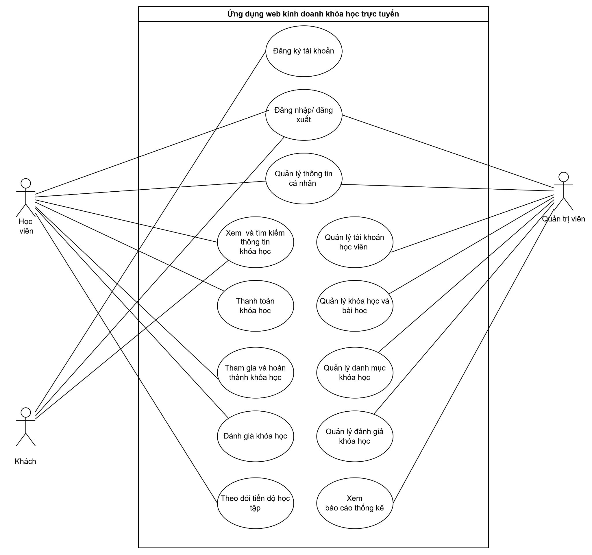
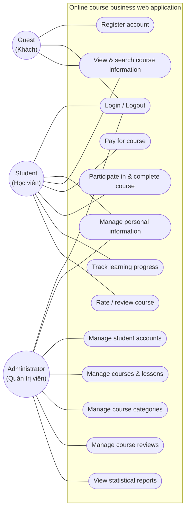
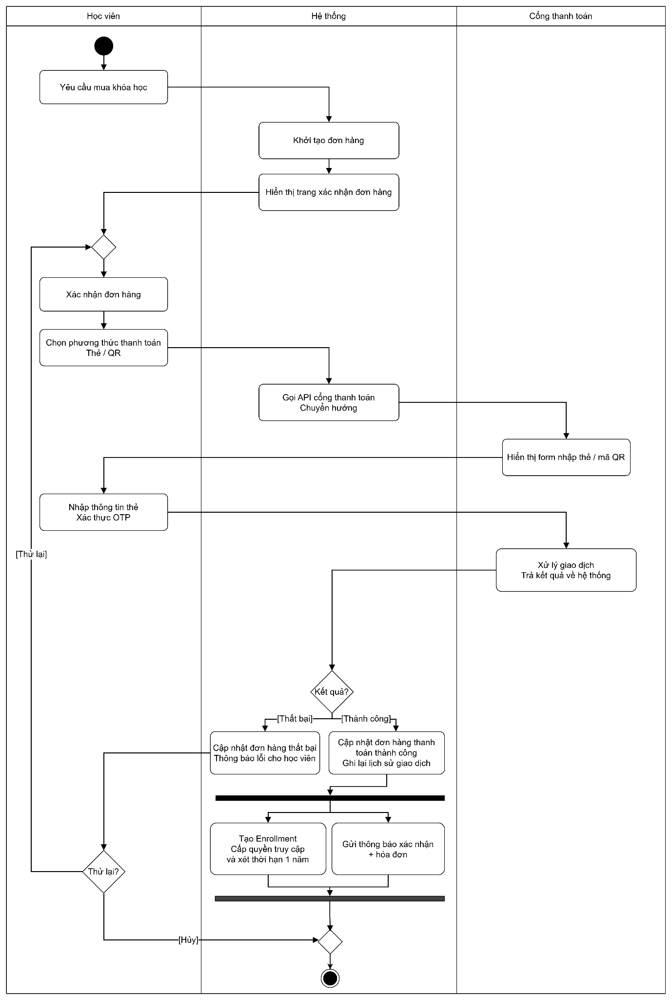
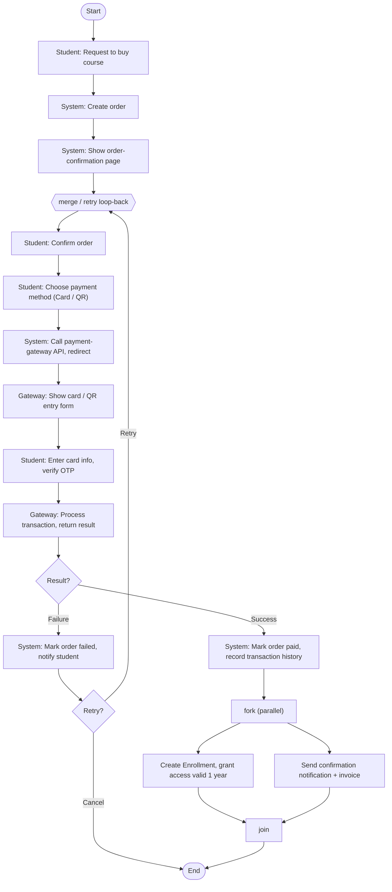
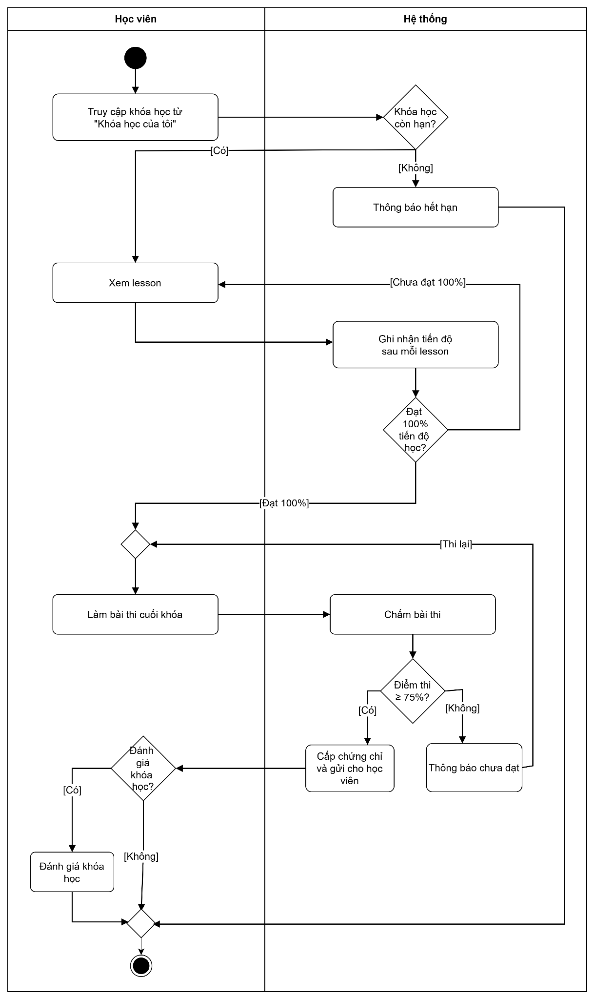
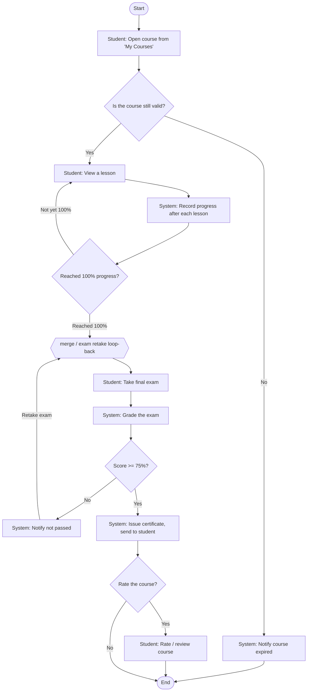

## CHƯƠNG 3: XÂY DỰNG PHẦN MỀM QUẢN LÝ VÀ HỌC TẬP TRỰC TUYẾN CHO CÔNG TY SEONGON

### 3.1. Mô tả bài toán

#### 3.1.1. User Story

Nhóm Khách

| **User Story**                                                                                                                                    | **Lợi ích**                                                                 |
|---------------------------------------------------------------------------------------------------------------------------------------------------|-----------------------------------------------------------------------------|
| Với tư cách là một  **khách**  , tôi muốn xem danh sách các khóa học trực tuyến đang có trên hệ thống                                             | để có thể tìm hiểu nội dung học tập trước khi quyết định đăng ký tài khoản. |
| Với tư cách là một  **khách**  , tôi muốn tìm kiếm và lọc khóa học theo từ khóa, danh mục và mức giá                                              | để nhanh chóng tìm được khóa học phù hợp với nhu cầu của mình.              |
| Với tư cách là một  **khách**  , tôi muốn xem trang chi tiết của từng khóa học bao gồm nội dung chương trình, giảng viên và đánh giá của học viên | để đánh giá chất lượng và quyết định có đăng ký hay không.                  |
| Với tư cách là một  **khách**  , tôi muốn đăng ký tài khoản học viên trên hệ thống                                                                | để có thể đăng nhập và tham gia học các khóa học trực tuyến.                |

Nhóm Học viên

| **User Story**                                                                                                  | **Lợi ích**                                                                              |
|-----------------------------------------------------------------------------------------------------------------|------------------------------------------------------------------------------------------|
| Với tư cách là một  **học viên**  , tôi muốn đăng nhập và đăng xuất khỏi hệ thống                               | để bảo mật tài khoản và truy cập vào nội dung học tập của mình.                          |
| Với tư cách là một  **học viên**  , tôi muốn cập nhật thông tin cá nhân và đổi mật khẩu tài khoản               | để đảm bảo thông tin hồ sơ của mình luôn chính xác và an toàn.                           |
| Với tư cách là một  **học viên**  , tôi muốn đăng ký tham gia khóa học sau khi xem chi tiết và xác nhận đăng ký | để được quyền truy cập toàn bộ nội dung bài học của khóa học đó.                         |
| Với tư cách là một  **học viên**  , tôi muốn xem danh sách các khóa học mà mình đã đăng ký                      | để dễ dàng quản lý và tiếp tục quá trình học tập.                                        |
| Với tư cách là một  **học viên**  , tôi muốn xem và học các bài học dạng video theo thứ tự trong khóa học       | để tiếp thu kiến thức một cách có hệ thống và linh hoạt theo thời gian của mình.         |
| Với tư cách là một  **học viên**  , tôi muốn theo dõi tiến độ hoàn thành bài học trong từng khóa học            | để biết mình đang ở đâu trong lộ trình học và cần học thêm những gì.                     |
| Với tư cách là một  **học viên**  , tôi muốn làm bài kiểm tra cuối khóa sau khi hoàn thành các bài học          | để đánh giá mức độ nắm vững kiến thức và đủ điều kiện nhận chứng chỉ.                    |
| Với tư cách là một  **học viên**  , tôi muốn xem kết quả bài kiểm tra ngay sau khi nộp bài                      | để biết điểm số, bài làm đúng/sai và quyết định có cần ôn lại hay không.                 |
| Với tư cách là một  **học viên**  , tôi muốn đánh giá và để lại nhận xét cho khóa học sau khi hoàn thành        | để chia sẻ trải nghiệm học tập và hỗ trợ các học viên khác trong việc lựa chọn khóa học. |
| Với tư cách là một  **học viên**  , tôi muốn nhận chứng chỉ hoàn thành khóa học khi đáp ứng đủ điều kiện        | để xác nhận thành quả học tập và có bằng chứng về kiến thức đã tích lũy.                 |

Nhóm Quản trị viên

| **User Story**                                                                                                                                              | **Lợi ích**                                                                             |
|-------------------------------------------------------------------------------------------------------------------------------------------------------------|-----------------------------------------------------------------------------------------|
| Với tư cách là một  **quản trị viên**  , tôi muốn xem danh sách tài khoản học viên và có thể kích hoạt hoặc khóa tài khoản                                  | để quản lý người dùng và đảm bảo hệ thống vận hành đúng quy định.                       |
| Với tư cách là một  **quản trị viên**  , tôi muốn thêm, sửa và xóa danh mục khóa học                                                                        | để phân loại nội dung đào tạo một cách có tổ chức, giúp học viên dễ tìm kiếm.           |
| Với tư cách là một  **quản trị viên**  , tôi muốn tạo mới, chỉnh sửa và xóa khóa học bao gồm thông tin tổng quan, hình ảnh và trạng thái xuất bản           | để cập nhật và duy trì danh mục khóa học luôn phù hợp với nhu cầu đào tạo của công ty.  |
| Với tư cách là một  **quản trị viên**  , tôi muốn thêm, sắp xếp và xóa các bài học/video trong từng khóa học                                                | để xây dựng nội dung học tập có cấu trúc rõ ràng và đảm bảo chất lượng học liệu.        |
| Với tư cách là một  **quản trị viên**  , tôi muốn tạo và chỉnh sửa bài kiểm tra cuối khóa bao gồm cấu hình điểm đạt và số lần làm lại                       | để kiểm soát chất lượng đầu ra của quá trình đào tạo.                                   |
| Với tư cách là một  **quản trị viên**  , tôi muốn thêm, sửa và xóa câu hỏi cùng các phương án trả lời trong ngân hàng câu hỏi                               | để xây dựng bộ đề kiểm tra đa dạng, phong phú và sát với nội dung từng khóa học.        |
| Với tư cách là một  **quản trị viên**  , tôi muốn xem và quản lý các đánh giá, nhận xét của học viên về khóa học                                            | để đảm bảo nội dung đánh giá phù hợp và phản hồi đúng đắn đến giảng viên/nhóm nội dung. |
| Với tư cách là một  **quản trị viên**  , tôi muốn xem dashboard thống kê tổng quan về số lượng học viên, số khóa học, tỷ lệ hoàn thành và doanh thu đăng ký | để theo dõi hiệu quả hoạt động đào tạo và hỗ trợ ra quyết định quản lý.                 |

#### 3.1.2. Các tác nhân sử dụng ứng dụng web

Hệ thống có 3 tác nhân chính:

|   **STT** | **Tác nhân**   | **Mô tả**                                                         |
|-----------|----------------|-------------------------------------------------------------------|
|         1 | Khách          | Người dùng chưa đăng nhập, truy cập hệ thống để tìm hiểu khóa học |
|         2 | Học viên       | Người dùng đã đăng ký tài khoản và đăng nhập vào hệ thống         |
|         3 | Quản trị viên  | Người quản lý và vận hành toàn bộ hệ thống                        |

##### 3.1.2.1. Actor Khách

- Xem danh sách khóa học
- Tìm kiếm, lọc khóa học theo từ khóa và danh mục
- Xem trang chi tiết khóa học
- Đăng ký tài khoản
- Đăng nhập

##### 3.1.2.2. Actor Học viên

##### 1 Đăng nhập / đăng xuất

##### 2 Xem và cập nhật thông tin cá nhân

##### 3 Đổi mật khẩu

##### 4 Xem danh sách khóa học

##### 5 Tìm kiếm, lọc khóa học

##### 6 Xem chi tiết khóa học

##### 7 Đăng ký khóa học

- Thanh toán khóa học

##### 8 Xem danh sách khóa học đã đăng ký

##### 9 Truy cập và xem bài học / video

##### 10 Theo dõi tiến độ hoàn thành bài học

##### 11 Làm bài kiểm tra cuối khóa

##### 12 Xem kết quả bài kiểm tra

##### 13 Đánh giá và nhận xét khóa học

##### 14 Xem và tải chứng chỉ hoàn thành khóa học

##### 3.1.2.2. Actor Quản trị viên

- Quản lý tài khoản

- Xem danh sách học viên
- Xem chi tiết tài khoản học viên

- Quản lý danh mục

- Thêm / sửa / xóa danh mục khóa học

- Quản lý khóa học

- Tạo mới khóa học
- Chỉnh sửa thông tin khóa học
- Xóa khóa học
- Xuất bản / ẩn khóa học

- Quản lý bài học

- Thêm / sửa / xóa bài học trong khóa học
- Sắp xếp thứ tự bài học
- Tải lên video và tài liệu học

- Quản lý bài kiểm tra

- Tạo / chỉnh sửa / xóa bài kiểm tra
- Cấu hình điểm đạt và số lần làm lại
- Thêm / sửa / xóa câu hỏi và đáp án

- Quản lý đánh giá

- Xem danh sách đánh giá của học viên
- Xóa đánh giá vi phạm

- Báo cáo thống kê

- Xem dashboard tổng quan
- Thống kê số lượng học viên, khóa học, tỷ lệ hoàn thành

### 3.2. Mô hình hóa hệ thống

#### 3.2.1. Sơ đồ Use Case

##### 3.2.1.1. Sơ đồ Use Case tổng quát

###### Hình 3.4. Sơ đồ Use Case tổng quát

<!-- ===================== AI-READABLE DIAGRAM DESCRIPTION (ENGLISH) ===================== -->

> **Figure 3.4 — General Use Case Diagram (English description for AI)**
>
> **Diagram type:** UML Use Case Diagram.
> **System boundary:** *Online course business web application* (VI: *Ứng dụng web kinh doanh khóa học trực tuyến*). All use cases sit inside this boundary; the three actors sit outside it.
>
> **Actors (3):**
> - **Guest** (VI: *Khách*) — unauthenticated visitor browsing the site.
> - **Student / Learner** (VI: *Học viên*) — a registered, logged-in user who buys and studies courses.
> - **Administrator** (VI: *Quản trị viên*) — operates and manages the whole platform.
>
> **Use cases and their actor associations** (a ✔ means an association line connects that actor to that use case):
>
> | # | Use case (EN) | Use case (VI) | Guest | Student | Admin |
> |---|---|---|:--:|:--:|:--:|
> | 1 | Register account | Đăng ký tài khoản | ✔ | | |
> | 2 | Login / Logout | Đăng nhập / đăng xuất | ✔ | ✔ | ✔ |
> | 3 | Manage personal information | Quản lý thông tin cá nhân | | ✔ | ✔ |
> | 4 | View & search course information | Xem và tìm kiếm thông tin khóa học | ✔ | ✔ | |
> | 5 | Pay for course | Thanh toán khóa học | | ✔ | |
> | 6 | Participate in & complete course | Tham gia và hoàn thành khóa học | | ✔ | |
> | 7 | Track learning progress | Theo dõi tiến độ học tập | | ✔ | |
> | 8 | Rate / review course | Đánh giá khóa học | | ✔ | |
> | 9 | Manage student accounts | Quản lý tài khoản học viên | | | ✔ |
> | 10 | Manage courses & lessons | Quản lý khóa học và bài học | | | ✔ |
> | 11 | Manage course categories | Quản lý danh mục khóa học | | | ✔ |
> | 12 | Manage course reviews | Quản lý đánh giá khóa học | | | ✔ |
> | 13 | View statistical reports | Xem báo cáo thống kê | | | ✔ |
>
> **Notes:** Guest owns the public/pre-login actions (browse, search, register, log in). Student inherits authenticated learning actions (buy, learn, track progress, review). Admin owns all management/back-office use cases plus reporting. Login/Logout is shared by all three; Manage personal information is shared by Student and Admin.

<!-- =================== END AI-READABLE DIAGRAM DESCRIPTION =================== -->

#### 3.2.2. Sơ đồ Activity

##### 3.2.2.1. Sơ đồ Activity quy trình học viên đăng ký khóa học trực tuyến

Học viên bắt đầu bằng cách gửi yêu cầu mua khóa học, sau đó tiến hành xác nhận đơn hàng trên trang hiển thị của hệ thống. Học viên chọn phương thức thanh toán bằng cách nhập thông tin thẻ xác thực OTP hoặc quét mã QR, hệ thống sẽ kết nối với cổng thanh toán để xử lý và kiểm tra kết quả giao dịch. Nếu thanh toán thành công, đơn hàng được cập nhật, đồng thời khóa học được kích hoạt tạo Enrollment với thời hạn sử dụng trong 1 năm và hệ thống gửi thông báo xác nhận kèm hóa đơn cho học viên. Nếu thanh toán thất bại, hệ thống sẽ hiển thị thông báo lỗi để học viên lựa chọn thực hiện thử lại hoặc hủy bỏ quy trình.

##### 

###### Hình 3.1. Sơ đồ Activity về quy trình học viên đăng ký học trực tuyến

<!-- ===================== AI-READABLE DIAGRAM DESCRIPTION (ENGLISH) ===================== -->

> **Figure 3.1 — Activity Diagram: Student course registration & payment (English description for AI)**
>
> **Diagram type:** UML Activity Diagram with **3 swimlanes (partitions):** **Student** (VI: *Học viên*), **System** (VI: *Hệ thống*), **Payment Gateway** (VI: *Cổng thanh toán*).
>
> **Step-by-step flow:**
> 1. **[Start]** in the Student lane.
> 2. **Student:** *Request to buy a course* (Yêu cầu mua khóa học).
> 3. **System:** *Create/initialize the order* (Khởi tạo đơn hàng).
> 4. **System:** *Show the order-confirmation page* (Hiển thị trang xác nhận đơn hàng).
> 5. Control returns to the Student lane at a **merge node** (this merge is also the loop-back target for a retry — see step 12a).
> 6. **Student:** *Confirm the order* (Xác nhận đơn hàng).
> 7. **Student:** *Choose payment method: Card or QR* (Chọn phương thức thanh toán Thẻ / QR).
> 8. **System:** *Call the payment-gateway API and redirect* (Gọi API cổng thanh toán, Chuyển hướng).
> 9. **Payment Gateway:** *Display the card / QR-code entry form* (Hiển thị form nhập thẻ / mã QR).
> 10. **Student:** *Enter card details and authenticate with OTP* (Nhập thông tin thẻ, Xác thực OTP).
> 11. **Payment Gateway:** *Process the transaction and return the result to the system* (Xử lý giao dịch, Trả kết quả về hệ thống).
> 12. **System — Decision `Result?` (Kết quả?):**
>     - **[Failure] (Thất bại):** *Mark the order as failed and notify the student of the error* (Cập nhật đơn hàng thất bại, Thông báo lỗi cho học viên) → **Student — Decision `Retry?` (Thử lại?):**
>       - **[Retry] (Thử lại):** loop back to the merge node at step 5 (re-confirm and pay again).
>       - **[Cancel] (Hủy):** go to the final merge node → **[End]**.
>     - **[Success] (Thành công):** *Mark the order as paid, record the transaction history* (Cập nhật đơn hàng thanh toán thành công, Ghi lại lịch sử giao dịch) → **Fork (parallel split)** into two concurrent actions:
>       - *Create the Enrollment, grant course access valid for 1 year* (Tạo Enrollment, Cấp quyền truy cập và xét thời hạn 1 năm).
>       - *Send a confirmation notification + invoice* (Gửi thông báo xác nhận + hóa đơn).
>       Both branches **join** at a synchronization bar → final merge node → **[End]**.
>
> **Key business rule:** a successful payment creates an Enrollment that grants access for **1 year**; a failed payment lets the student retry or cancel.

<!-- =================== END AI-READABLE DIAGRAM DESCRIPTION =================== -->

##### 3.2.2.2. Sơ đồ Activity quy trình học viên học trực tuyến

Học viên bắt đầu bằng cách truy cập website và đăng nhập, sau đó tìm kiếm, xem chi tiết khóa học. Học viên chọn cách thanh toán bằng nhập mã số thẻ hoặc quét QR code ngân hàng, khóa học được kích hoạt nhưng sẽ hết hạn sau 1 năm. Khi học viên hoàn thành hết các phần, nếu bài thi đạt &gt;=75%, học viên phải đánh giá khóa học để được nhận chứng chỉ. Nếu chưa đạt, học viên sẽ được thông báo để tiếp tục thi lại.

###### 

###### Hình 3.2. Sơ đồ Activity về quy trình học viên học trực tuyến

<!-- ===================== AI-READABLE DIAGRAM DESCRIPTION (ENGLISH) ===================== -->

> **Figure 3.2 — Activity Diagram: Student online-learning process (English description for AI)**
>
> **Diagram type:** UML Activity Diagram with **2 swimlanes (partitions):** **Student** (VI: *Học viên*) and **System** (VI: *Hệ thống*).
>
> **Step-by-step flow:**
> 1. **[Start]** in the Student lane.
> 2. **Student:** *Open a course from "My Courses"* (Truy cập khóa học từ "Khóa học của tôi").
> 3. **System — Decision `Is the course still valid?` (Khóa học còn hạn?):**
>     - **[No] (Không):** *Notify that the course has expired* (Thông báo hết hạn) → go to the final merge node → **[End]**.
>     - **[Yes] (Có):** continue to step 4.
> 4. **Student:** *View a lesson* (Xem lesson).
> 5. **System:** *Record progress after each lesson* (Ghi nhận tiến độ sau mỗi lesson).
> 6. **System — Decision `Reached 100% learning progress?` (Đạt 100% tiến độ học?):**
>     - **[Not yet 100%] (Chưa đạt 100%):** loop back to step 4 (*View a lesson*).
>     - **[Reached 100%] (Đạt 100%):** continue to a merge node in the Student lane (also the loop-back target for an exam retake — see step 9).
> 7. **Student:** *Take the final exam* (Làm bài thi cuối khóa).
> 8. **System:** *Grade the exam* (Chấm bài thi).
> 9. **System — Decision `Exam score ≥ 75%?` (Điểm thi ≥ 75%?):**
>     - **[No] (Không):** *Notify not passed* (Thông báo chưa đạt) → **[Retake exam] (Thi lại):** loop back to the merge node before step 7.
>     - **[Yes] (Có):** *Issue the certificate and send it to the student* (Cấp chứng chỉ và gửi cho học viên) → continue to step 10.
> 10. **Student — Decision `Rate the course?` (Đánh giá khóa học?):**
>     - **[Yes] (Có):** *Rate / review the course* (Đánh giá khóa học) → final merge node → **[End]**.
>     - **[No] (Không):** go straight to the final merge node → **[End]**.
> 11. **[End]**.
>
> **Key business rules:** the course must still be within its validity period to be studied; the student must reach **100% lesson progress** before the final exam; a passing score is **≥ 75%** (below that, the student is notified and may retake the exam); after passing, the certificate is issued and rating the course is optional.
>
> *(Note: the surrounding prose in §3.2.2.2 states the student "must rate the course to receive the certificate"; the diagram as drawn issues the certificate first and then treats the course rating as an optional final step. This description reflects the diagram exactly as drawn.)*

<!-- =================== END AI-READABLE DIAGRAM DESCRIPTION =================== -->