# CHƯƠNG 3: XÂY DỰNG PHẦN MỀM QUẢN LÝ VÀ HỌC TẬP TRỰC TUYẾN CHO CÔNG TY SEONGON

## 3.1. Mô tả bài toán

### 3.1.1. User Story

### 3.1.1.1. User Story tác nhân Khách

| **User Story**                                                                                                                                    | **Lợi ích**                                                                 |
|---------------------------------------------------------------------------------------------------------------------------------------------------|-----------------------------------------------------------------------------|
| Với tư cách là một  **khách**  , tôi muốn xem danh sách các khóa học trực tuyến đang có trên hệ thống                                             | để có thể tìm hiểu nội dung học tập trước khi quyết định đăng ký tài khoản. |
| Với tư cách là một  **khách**  , tôi muốn tìm kiếm và lọc khóa học theo từ khóa, danh mục và mức giá                                              | để nhanh chóng tìm được khóa học phù hợp với nhu cầu của mình.              |
| Với tư cách là một  **khách**  , tôi muốn xem trang chi tiết của từng khóa học bao gồm nội dung chương trình, giảng viên và đánh giá của học viên | để đánh giá chất lượng và quyết định có đăng ký hay không.                  |
| Với tư cách là một  **khách**  , tôi muốn đăng ký tài khoản học viên trên hệ thống                                                                | để có thể đăng nhập và tham gia học các khóa học trực tuyến.                |

***3.1.1.2. User Story tác nhân*** Học viên

| **User Story**                                                                                                  | **Lợi ích**                                                                              |
|-----------------------------------------------------------------------------------------------------------------|------------------------------------------------------------------------------------------|
| Với tư cách là một  **học viên**  , tôi muốn đăng nhập và đăng xuất khỏi hệ thống                               | để bảo mật tài khoản và truy cập vào nội dung học tập của mình.                          |
| Với tư cách là một  **học viên**  , tôi muốn cập nhật thông tin cá nhân và đổi mật khẩu tài khoản               | để đảm bảo thông tin hồ sơ của mình luôn chính xác và an toàn.                           |
| Với tư cách là một  **học viên**  , tôi muốn đăng ký tham gia khóa học sau khi xem chi tiết và xác nhận đăng ký | để được quyền truy cập toàn bộ nội dung bài học của khóa học đó.                         |
| Với tư cách là một  **học viên**  , tôi muốn xem danh sách các khóa học mà mình đã đăng ký                      | để dễ dàng quản lý và tiếp tục quá trình học tập.                                        |
| Với tư cách là một  **học viên**  , tôi muốn xem và học các bài học dạng video theo thứ tự trong khóa học       | để tiếp thu kiến thức một cách có hệ thống và linh hoạt theo thời gian của mình.         |
| Với tư cách là một  **học viên**  , tôi muốn theo dõi tiến độ hoàn thành bài học trong từng khóa học            | để biết mình đang ở đâu trong lộ trình học và cần học thêm những gì.                     |
| Với tư cách là một  **học viên**  , tôi muốn làm bài kiểm tra cuối khóa sau khi hoàn thành các bài học          | để đánh giá mức độ nắm vững kiến thức và đủ điều kiện nhận chứng chỉ.                    |
| Với tư cách là một  **học viên**  , tôi muốn xem kết quả bài kiểm tra ngay sau khi nộp bài                      | để biết điểm số, bài làm đúng/sai và quyết định có cần ôn lại hay không.                 |
| Với tư cách là một  **học viên**  , tôi muốn đánh giá và để lại nhận xét cho khóa học sau khi hoàn thành        | để chia sẻ trải nghiệm học tập và hỗ trợ các học viên khác trong việc lựa chọn khóa học. |
| Với tư cách là một  **học viên**  , tôi muốn nhận chứng chỉ hoàn thành khóa học khi đáp ứng đủ điều kiện        | để xác nhận thành quả học tập và có bằng chứng về kiến thức đã tích lũy.                 |

***3.1.1.3. User Story tác nhân*** Quản trị viên

| **User Story**                                                                                                                                              | **Lợi ích**                                                                             |
|-------------------------------------------------------------------------------------------------------------------------------------------------------------|-----------------------------------------------------------------------------------------|
| Với tư cách là một  **quản trị viên**  , tôi muốn xem danh sách tài khoản học viên và có thể kích hoạt hoặc khóa tài khoản                                  | để quản lý người dùng và đảm bảo hệ thống vận hành đúng quy định.                       |
| Với tư cách là một  **quản trị viên**  , tôi muốn thêm, sửa và xóa danh mục khóa học                                                                        | để phân loại nội dung đào tạo một cách có tổ chức, giúp học viên dễ tìm kiếm.           |
| Với tư cách là một  **quản trị viên**  , tôi muốn tạo mới, chỉnh sửa và xóa khóa học bao gồm thông tin tổng quan, hình ảnh và trạng thái xuất bản           | để cập nhật và duy trì danh mục khóa học luôn phù hợp với nhu cầu đào tạo của công ty.  |
| Với tư cách là một  **quản trị viên**  , tôi muốn thêm, sắp xếp và xóa các bài học/video trong từng khóa học                                                | để xây dựng nội dung học tập có cấu trúc rõ ràng và đảm bảo chất lượng học liệu.        |
| Với tư cách là một  **quản trị viên**  , tôi muốn tạo và chỉnh sửa bài kiểm tra cuối khóa bao gồm cấu hình điểm đạt và số lần làm lại                       | để kiểm soát chất lượng đầu ra của quá trình đào tạo.                                   |
| Với tư cách là một  **quản trị viên**  , tôi muốn thêm, sửa và xóa câu hỏi cùng các phương án trả lời trong ngân hàng câu hỏi                               | để xây dựng bộ đề kiểm tra đa dạng, phong phú và sát với nội dung từng khóa học.        |
| Với tư cách là một  **quản trị viên**  , tôi muốn xem và quản lý các đánh giá, nhận xét của học viên về khóa học                                            | để đảm bảo nội dung đánh giá phù hợp và phản hồi đúng đắn đến giảng viên/nhóm nội dung. |
| Với tư cách là một  **quản trị viên**  , tôi muốn xem dashboard thống kê tổng quan về số lượng học viên, số khóa học, tỷ lệ hoàn thành và doanh thu đăng ký | để theo dõi hiệu quả hoạt động đào tạo và hỗ trợ ra quyết định quản lý.                 |

### 3.1.2. Yêu cầu chức năng

#### 3.1.2.1. Actor Khách

- Xem danh sách khóa học
- Tìm kiếm, lọc khóa học theo từ khóa và danh mục
- Xem trang chi tiết khóa học
- Đăng ký tài khoản
- Đăng nhập

#### 3.1.2.2. Actor Học viên

#### 1 Đăng nhập / đăng xuất

#### 2 Xem và cập nhật thông tin cá nhân

#### 3 Đổi mật khẩu

#### 4 Xem danh sách khóa học

#### 5 Tìm kiếm, lọc khóa học

#### 6 Xem chi tiết khóa học

#### 7 Đăng ký khóa học

- Thanh toán khóa học

#### 8 Xem danh sách khóa học đã đăng ký

#### 9 Truy cập và xem bài học / video

#### 10 Theo dõi tiến độ hoàn thành bài học

#### 11 Làm bài kiểm tra cuối khóa

#### 12 Xem kết quả bài kiểm tra

#### 13 Đánh giá và nhận xét khóa học

#### 14 Xem và tải chứng chỉ hoàn thành khóa học

#### 3.1.2.2. Actor Quản trị viên

- Quản lý tài khoản

- Xem danh sách học viên
- Xem chi tiết tài khoản học viên

- Quản lý danh mục

- Thêm / sửa / xóa danh mục khóa học

- Quản lý khóa học

- Tạo mới khóa học
- Chỉnh sửa thông tin khóa học
- Xóa khóa học
- Xuất bản / ẩn khóa học

- Quản lý bài học

- Thêm / sửa / xóa bài học trong khóa học
- Sắp xếp thứ tự bài học
- Tải lên video và tài liệu học

- Quản lý bài kiểm tra

- Tạo / chỉnh sửa / xóa bài kiểm tra
- Cấu hình điểm đạt và số lần làm lại
- Thêm / sửa / xóa câu hỏi và đáp án

- Quản lý đánh giá

- Xem danh sách đánh giá của học viên
- Xóa đánh giá vi phạm

- Báo cáo thống kê

- Xem dashboard tổng quan
- Thống kê số lượng học viên, khóa học, tỷ lệ hoàn thành

## 3.2. Mô hình hóa hệ thống

### 3.2.1. Sơ đồ Use Case

#### 3.2.1.1. Sơ đồ Use Case tổng quát

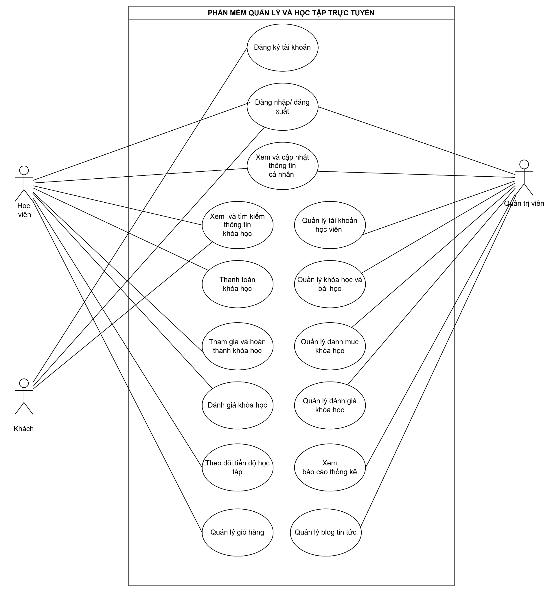

#### 3.2.1.2. Sơ đồ Use Case phân rã

##### 3.2.1.2.1. Sơ đồ Use Case đăng ký

| Tên               | Đăng ký tài khoản                                                                                                                                                                                                                                                                                                                                                                                                                                                                           |
|-------------------|---------------------------------------------------------------------------------------------------------------------------------------------------------------------------------------------------------------------------------------------------------------------------------------------------------------------------------------------------------------------------------------------------------------------------------------------------------------------------------------------|
| Mô tả             | Cho phép Khách tạo tài khoản học viên mới trên hệ thống để có thể đăng nhập và tham gia học các khóa học trực tuyến.                                                                                                                                                                                                                                                                                                                                                                        |
| Tác nhân          | Khách                                                                                                                                                                                                                                                                                                                                                                                                                                                                                       |
| Tiền điều kiện    | Người dùng chưa có tài khoản trên hệ thống và đang truy cập ở trạng thái chưa đăng nhập.                                                                                                                                                                                                                                                                                                                                                                                                    |
| Luồng cơ sở       | 1. Khách truy cập trang Đăng ký tài khoản.  2. Hệ thống hiển thị form đăng ký gồm các trường: Họ tên, Email, Mật khẩu, Xác nhận mật khẩu.  3. Khách điền đầy đủ thông tin vào form.  4. Khách nhấn nút "Đăng ký".  5. Hệ thống kiểm tra tính hợp lệ của dữ liệu đầu vào.  6. Hệ thống kiểm tra email chưa được đăng ký trước đó.  7. Hệ thống tạo tài khoản học viên mới với trạng thái "Hoạt động".  8. Hệ thống hiển thị thông báo đăng ký thành công và chuyển hướng về trang đăng nhập. |
| Luồng thay thế    | [Dữ liệu không hợp lệ]  Tại bước 5, nếu có trường bắt buộc bị bỏ trống, email sai định dạng, mật khẩu không đủ độ dài hoặc hai trường mật khẩu không khớp, hệ thống hiển thị thông báo lỗi tương ứng ngay tại trường vi phạm.  Use Case quay lại bước 3.                                                                                                                                                                                                                                    |
| Luồng ngoại lệ    | [Email đã tồn tại]  Tại bước 6, nếu email đã được đăng ký trong hệ thống, hệ thống hiển thị thông báo: "Email này đã được sử dụng. Vui lòng đăng nhập hoặc dùng email khác."  Use Case dừng lại.                                                                                                                                                                                                                                                                                            |
| Hậu điều kiện     | Tài khoản học viên mới được tạo thành công và lưu vào cơ sở dữ liệu.  Người dùng có thể đăng nhập bằng email và mật khẩu vừa đăng ký.                                                                                                                                                                                                                                                                                                                                                       |
| Quy tắc nghiệp vụ | - Email phải đúng định dạng và là duy nhất trong hệ thống.  - Mật khẩu tối thiểu 8 ký tự.  - Mật khẩu phải khớp với trường xác nhận mật khẩu.  - Tài khoản mới tạo mặc định có vai trò Học viên (role = student).                                                                                                                                                                                                                                                                           |

Bảng 3.X. Đặc tả Use Case Đăng ký tài khoản

*3.2.1.2.1. Sơ đồ Use Case* đăng nhập / đăng xuất

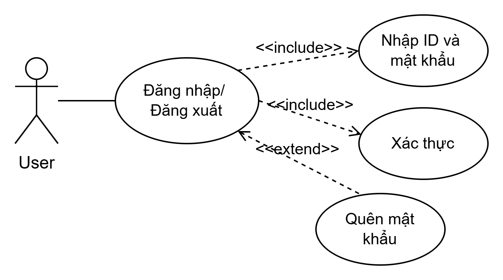

| Tên               | Đăng nhập / Đăng xuất                                                                                                                                                                                                                                                                                                                                                                                                                                                                                                                                      |
|-------------------|------------------------------------------------------------------------------------------------------------------------------------------------------------------------------------------------------------------------------------------------------------------------------------------------------------------------------------------------------------------------------------------------------------------------------------------------------------------------------------------------------------------------------------------------------------|
| Mô tả             | Cho phép Học viên và Quản trị viên xác thực danh tính để truy cập vào hệ thống, đồng thời cho phép kết thúc phiên làm việc một cách an toàn.                                                                                                                                                                                                                                                                                                                                                                                                               |
| Tác nhân          | Học viên, Quản trị viên                                                                                                                                                                                                                                                                                                                                                                                                                                                                                                                                    |
| Tiền điều kiện    | Người dùng đã có tài khoản hợp lệ trong hệ thống.                                                                                                                                                                                                                                                                                                                                                                                                                                                                                                          |
| Luồng cơ sở       | 1. Người dùng truy cập trang Đăng nhập.  2. Hệ thống hiển thị form đăng nhập gồm Email và Mật khẩu.  3. Người dùng nhập thông tin đăng nhập.  4. Người dùng nhấn nút "Đăng nhập".  5. Hệ thống kiểm tra thông tin đăng nhập.  6. Hệ thống xác thực vai trò của tài khoản (Học viên hoặc Quản trị viên).  7. Hệ thống tạo phiên đăng nhập và chuyển hướng người dùng đến trang chủ tương ứng với vai trò.  [Đăng xuất]  8. Người dùng chọn chức năng Đăng xuất.  9. Hệ thống xóa phiên đăng nhập.  10. Hệ thống chuyển hướng người dùng về trang đăng nhập. |
| Luồng thay thế    | [Quên mật khẩu]  Ở bước 2, người dùng chọn quên mật khẩu, hệ thống gửi mã OTP, người dùng nhập mã OTP và xác nhận. Hệ thống sẽ hiển thị form đặt lại mật khẩu. Người dùng nhập mật khẩu mới và xác nhận. Mật khẩu mới được cập nhật lên CSDL, hệ thống thông báo thành công và yêu cầu đăng nhập lại bằng mật khẩu mới.  Use Case tiếp tục bước 3 ở luồng cơ sở.                                                                                                                                                                                           |
| Luồng ngoại lệ    | [Email hoặc mật khẩu không đúng]  Tại bước 5, nếu email không tồn tại hoặc mật khẩu không khớp, hệ thống hiển thị thông báo: "Email hoặc mật khẩu không đúng."  Use Case quay lại bước 3.                                                                                                                                                                                                                                                                                                                                                                  |
| Hậu điều kiện     | Người dùng đăng nhập thành công và được chuyển đến trang chủ tương ứng vai trò.  Hoặc phiên đăng nhập được hủy và người dùng được chuyển về trang đăng nhập sau khi đăng xuất.                                                                                                                                                                                                                                                                                                                                                                             |
| Quy tắc nghiệp vụ | - Hệ thống phân quyền dựa trên vai trò tài khoản (role = student / admin).  - Tài khoản bị khóa không được phép đăng nhập.  - Mật khẩu được lưu trữ dưới dạng mã hóa (hashed), không lưu dạng plaintext.                                                                                                                                                                                                                                                                                                                                                   |

Bảng 3.X+1. Đặc tả Use Case Đăng nhập / Đăng xuất

*3.2.1.2.1. Sơ đồ Use Case xem và cập nhật thông tin cá nhân*

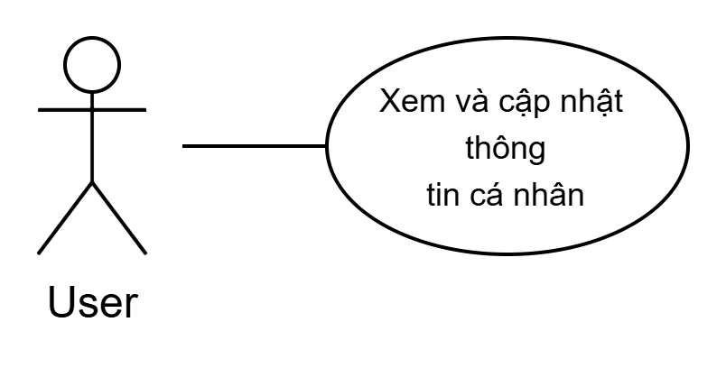

| Tên               | Xem và cập nhật thông tin cá nhân                                                                                                                                                                                                                                                                                                                                                                                                                                                                 |
|-------------------|---------------------------------------------------------------------------------------------------------------------------------------------------------------------------------------------------------------------------------------------------------------------------------------------------------------------------------------------------------------------------------------------------------------------------------------------------------------------------------------------------|
| Mô tả             | Cho phép Học viên và Quản trị viên xem thông tin hồ sơ hiện tại và cập nhật các thông tin cá nhân được phép chỉnh sửa.                                                                                                                                                                                                                                                                                                                                                                            |
| Tác nhân          | Học viên, Quản trị viên                                                                                                                                                                                                                                                                                                                                                                                                                                                                           |
| Tiền điều kiện    | Người dùng đã đăng nhập vào hệ thống.                                                                                                                                                                                                                                                                                                                                                                                                                                                             |
| Luồng cơ sở       | #### 1. Người dùng truy cập trang Thông tin cá nhân.  #### 2. Hệ thống hiển thị thông tin hồ sơ hiện tại (họ tên, email, ảnh đại diện, số điện thoại,...).  #### 3. Người dùng chọn Chỉnh sửa thông tin.  #### 4. Hệ thống hiển thị form chỉnh sửa với dữ liệu hiện tại.  #### 5. Người dùng cập nhật các trường muốn thay đổi.  #### 6. Người dùng nhấn Lưu.  #### 7. Hệ thống kiểm tra tính hợp lệ của dữ liệu.  #### 8. Hệ thống cập nhật thông tin và hiển thị thông báo cập nhật thành công. |
| Luồng thay thế    | #### [Người dùng không thay đổi gì]  #### Tại bước 5, người dùng không sửa trường nào và nhấn Hủy.  #### Hệ thống quay lại trang Thông tin cá nhân với dữ liệu ban đầu.                                                                                                                                                                                                                                                                                                                           |
| Luồng ngoại lệ    | #### [Dữ liệu không hợp lệ]  #### Tại bước 7, nếu có trường bắt buộc bị bỏ trống hoặc dữ liệu sai định dạng, hệ thống hiển thị thông báo lỗi tương ứng.  #### Use Case quay lại bước 5.                                                                                                                                                                                                                                                                                                           |
| Hậu điều kiện     | Thông tin cá nhân của người dùng được cập nhật thành công trong cơ sở dữ liệu.                                                                                                                                                                                                                                                                                                                                                                                                                    |
| Quy tắc nghiệp vụ | #### - Email không thể thay đổi (dùng làm định danh tài khoản).  #### - Ảnh đại diện nếu có phải đúng định dạng ảnh (JPG, PNG) và kích thước ≤ 5MB.                                                                                                                                                                                                                                                                                                                                               |

### Bảng 3.X+2. Đặc tả Use Case Xem và cập nhật thông tin cá nhân

### 3.2.1.2.1. Sơ đồ Use Case xem và tìm kiếm thông tin khóa học

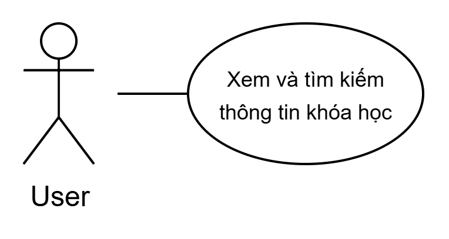

### Hình 3.X+3. Sơ đồ Use Case Xem và tìm kiếm thông tin khóa học

| Tên               | Xem và tìm kiếm thông tin khóa học                                                                                                                                                                                                                                                                                                                                                                                    |
|-------------------|-----------------------------------------------------------------------------------------------------------------------------------------------------------------------------------------------------------------------------------------------------------------------------------------------------------------------------------------------------------------------------------------------------------------------|
| Mô tả             | Cho phép Khách và Học viên xem danh sách các khóa học hiện có trên hệ thống, tìm kiếm theo từ khóa, lọc theo danh mục và xem trang chi tiết của từng khóa học.                                                                                                                                                                                                                                                        |
| Tác nhân          | Khách, Học viên                                                                                                                                                                                                                                                                                                                                                                                                       |
| Tiền điều kiện    | -                                                                                                                                                                                                                                                                                                                                                                                                                     |
| Luồng cơ sở       | #### 1. Người dùng truy cập trang danh sách khóa học.  #### 2. Hệ thống tải và hiển thị danh sách tất cả khóa học đang hoạt động, bao gồm: tên khóa học, ảnh bìa, danh mục, đánh giá và số lượng học viên đã học.  #### 3. Người dùng chọn một khóa học để xem chi tiết.  #### 4. Hệ thống hiển thị trang chi tiết khóa học gồm: mô tả, chương trình học, thông tin giảng viên, đánh giá của học viên và nút Đăng ký. |
| Luồng thay thế    | #### [Tìm kiếm theo từ khóa]  #### Tại bước 2, người dùng nhập từ khóa vào ô tìm kiếm.  #### Hệ thống hiển thị danh sách khóa học có tên hoặc mô tả chứa từ khóa.  ####   #### [Lọc theo danh mục]  #### Tại bước 2, người dùng chọn một danh mục khóa học.  #### Hệ thống lọc và hiển thị danh sách khóa học thuộc danh mục đã chọn.                                                                                 |
| Luồng ngoại lệ    | #### [Không có kết quả phù hợp]  #### Tại bước 2 (sau khi tìm kiếm/lọc), nếu không có khóa học phù hợp, hệ thống hiển thị thông báo: "Không tìm thấy khóa học phù hợp với yêu cầu của bạn."  #### Use Case dừng lại.                                                                                                                                                                                                  |
| Hậu điều kiện     | Danh sách hoặc trang chi tiết khóa học được hiển thị đầy đủ theo yêu cầu của người dùng.                                                                                                                                                                                                                                                                                                                              |
| Quy tắc nghiệp vụ | #### - Chỉ hiển thị các khóa học có trạng thái "Đã xuất bản".  #### - Khách và Học viên đều có thể xem thông tin khóa học nhưng chỉ Học viên mới có thể đăng ký.                                                                                                                                                                                                                                                      |

### Bảng 3.X+4. Đặc tả Use Case Xem và tìm kiếm thông tin khóa học

### 3.2.1.2.1. Sơ đồ Use Case Thanh toán khóa học

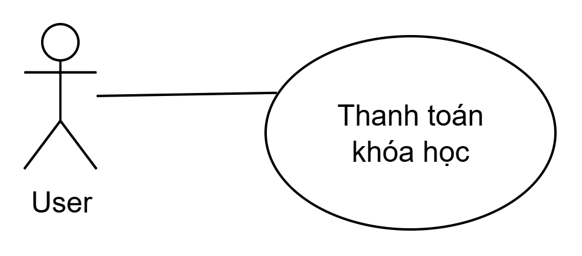

### Hình 3.X+4. Sơ đồ Use Case Thanh toán khóa học

### Use Case: Thanh toán khóa học

| Tên               | Thanh toán khóa học                                                                                                                                                                                                                                                                                                                                                                                                                                                                      |
|-------------------|------------------------------------------------------------------------------------------------------------------------------------------------------------------------------------------------------------------------------------------------------------------------------------------------------------------------------------------------------------------------------------------------------------------------------------------------------------------------------------------|
| Mô tả             | Cho phép Học viên đăng ký và xác nhận tham gia một khóa học. Hệ thống ghi nhận đăng ký và cấp quyền truy cập nội dung khóa học cho học viên.                                                                                                                                                                                                                                                                                                                                             |
| Tác nhân          | Học viên                                                                                                                                                                                                                                                                                                                                                                                                                                                                                 |
| Tiền điều kiện    | #### Học viên đã đăng nhập vào hệ thống.  #### Khóa học đang ở trạng thái "Đã xuất bản" và chưa được học viên đăng ký.                                                                                                                                                                                                                                                                                                                                                                   |
| Luồng cơ sở       | #### 1. Học viên truy cập trang chi tiết khóa học.  #### 2. Hệ thống hiển thị thông tin khóa học và nút "Đăng ký khóa học".  #### 3. Học viên nhấn nút "Đăng ký khóa học".  #### 4. Hệ thống hiển thị trang xác nhận đăng ký với thông tin khóa học.  #### 5. Học viên xác nhận đăng ký.  #### 6. Hệ thống tạo bản ghi đăng ký (enrollment) cho học viên với trạng thái "Đang học".  #### 7. Hệ thống hiển thị thông báo đăng ký thành công và chuyển hướng học viên đến trang khóa học. |
| Luồng thay thế    | #### [Học viên hủy xác nhận]  #### Tại bước 5, học viên nhấn Hủy.  #### Hệ thống quay lại trang chi tiết khóa học, không tạo bản ghi đăng ký.                                                                                                                                                                                                                                                                                                                                            |
| Luồng ngoại lệ    | #### [Học viên chưa đăng nhập]  #### Tại bước 3, nếu học viên chưa đăng nhập, hệ thống chuyển hướng đến trang đăng nhập.  #### Sau khi đăng nhập thành công, hệ thống quay lại trang chi tiết khóa học.  ####   #### [Học viên đã đăng ký khóa học này]  #### Tại bước 3, hệ thống hiển thị thông báo: "Bạn đã đăng ký khóa học này. Tiếp tục học ngay?" và cung cấp liên kết đến trang học bài.                                                                                         |
| Hậu điều kiện     | #### Bản ghi đăng ký (enrollment) được tạo thành công trong cơ sở dữ liệu.  #### Học viên được cấp quyền truy cập toàn bộ nội dung bài học của khóa học.                                                                                                                                                                                                                                                                                                                                 |
| Quy tắc nghiệp vụ | #### - Mỗi học viên chỉ được đăng ký một lần cho mỗi khóa học.  #### - Học viên chỉ được truy cập nội dung khóa học sau khi đã đăng ký thành công.                                                                                                                                                                                                                                                                                                                                       |

### Bảng 3.X+5. Đặc tả Use Case Thanh toán khóa học

### 3.2.1.2.1. Sơ đồ Use Case Tham gia và hoàn thành khóa học

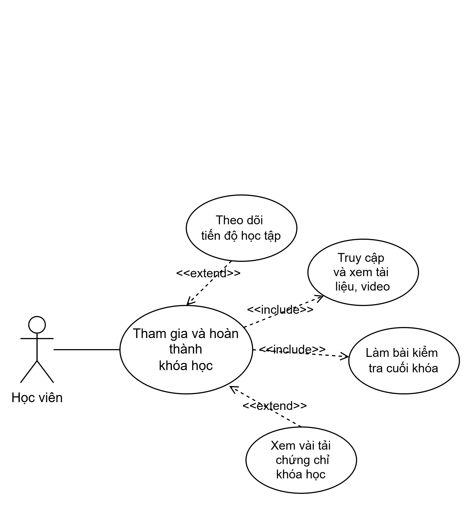

### Hình 3.X+5. Sơ đồ Use Case Tham gia và hoàn thành khóa học

| Tên               | Truy cập và xem bài học / video                                                                                                                                                                                                                                                                                                                                                                                           |
|-------------------|---------------------------------------------------------------------------------------------------------------------------------------------------------------------------------------------------------------------------------------------------------------------------------------------------------------------------------------------------------------------------------------------------------------------------|
| Mô tả             | Cho phép Học viên đã đăng ký khóa học truy cập và xem nội dung bài học dưới dạng video theo thứ tự trong chương trình học.                                                                                                                                                                                                                                                                                                |
| Tác nhân          | Học viên                                                                                                                                                                                                                                                                                                                                                                                                                  |
| Tiền điều kiện    | #### Học viên đã đăng nhập vào hệ thống.  #### Học viên đã đăng ký khóa học.                                                                                                                                                                                                                                                                                                                                              |
| Luồng cơ sở       | #### 1. Học viên truy cập trang "Khóa học của tôi" và chọn khóa học muốn học.  #### 2. Hệ thống hiển thị danh sách bài học theo thứ tự chương trình.  #### 3. Học viên chọn một bài học.  #### 4. Hệ thống tải và hiển thị nội dung bài học (video, tài liệu đính kèm).  #### 5. Học viên xem video bài học đến khi kết thúc.  #### 6. Hệ thống tự động đánh dấu bài học là "Đã hoàn thành" và cập nhật tiến độ khóa học. |
| Luồng thay thế    | #### [Học viên thoát bài học giữa chừng]  #### Tại bước 5, học viên đóng trang hoặc chuyển sang bài học khác.  #### Hệ thống lưu lại vị trí đã xem và không đánh dấu bài học là "Đã hoàn thành".                                                                                                                                                                                                                          |
| Luồng ngoại lệ    | #### [Học viên chưa đăng ký khóa học]  #### Tại bước 3, nếu học viên chưa đăng ký, hệ thống hiển thị thông báo yêu cầu đăng ký khóa học và chuyển đến trang đăng ký.                                                                                                                                                                                                                                                      |
| Hậu điều kiện     | #### Tiến độ học tập của học viên được cập nhật sau mỗi bài học hoàn thành.  #### Bài học được đánh dấu "Đã hoàn thành" trong hệ thống.                                                                                                                                                                                                                                                                                   |
| Quy tắc nghiệp vụ | #### - Học viên chỉ được xem bài học của khóa học mình đã đăng ký.  #### - Bài học chỉ được đánh dấu "Đã hoàn thành" khi học viên xem hết video.  #### - Học viên có thể xem lại bài học đã hoàn thành bất kỳ lúc nào.                                                                                                                                                                                                    |

### Bảng 3.X+6. Đặc tả Use Case Truy cập và xem bài học / video

| Tên               | Làm bài kiểm tra cuối khóa                                                                                                                                                                                                                                                                                                                                                                                                                                                                                                            |
|-------------------|---------------------------------------------------------------------------------------------------------------------------------------------------------------------------------------------------------------------------------------------------------------------------------------------------------------------------------------------------------------------------------------------------------------------------------------------------------------------------------------------------------------------------------------|
| Mô tả             | Cho phép Học viên thực hiện bài kiểm tra cuối khóa sau khi đã hoàn thành tất cả bài học. Kết quả bài kiểm tra là cơ sở xác định điều kiện nhận chứng chỉ.                                                                                                                                                                                                                                                                                                                                                                             |
| Tác nhân          | Học viên                                                                                                                                                                                                                                                                                                                                                                                                                                                                                                                              |
| Tiền điều kiện    | #### Học viên đã đăng nhập và đã đăng ký khóa học.  #### Học viên đã hoàn thành toàn bộ bài học trong khóa học.  #### Học viên còn lượt làm bài kiểm tra.                                                                                                                                                                                                                                                                                                                                                                             |
| Luồng cơ sở       | #### 1. Học viên truy cập trang khóa học và chọn mục "Bài kiểm tra cuối khóa".  #### 2. Hệ thống hiển thị thông tin bài kiểm tra: số câu hỏi, thời gian làm bài, điểm đạt yêu cầu.  #### 3. Học viên nhấn "Bắt đầu làm bài".  #### 4. Hệ thống hiển thị các câu hỏi trắc nghiệm theo thứ tự và bắt đầu đếm thời gian.  #### 5. Học viên lần lượt chọn đáp án cho từng câu hỏi.  #### 6. Học viên nhấn "Nộp bài" sau khi hoàn thành.  #### 7. Hệ thống tính điểm, lưu kết quả và hiển thị trang kết quả gồm: điểm số, số câu đúng/sai. |
| Luồng thay thế    | #### [Hết thời gian làm bài]  #### Khi đồng hồ đếm ngược về 0, hệ thống tự động nộp bài.  #### Use Case tiếp tục từ bước 7.                                                                                                                                                                                                                                                                                                                                                                                                           |
| Luồng ngoại lệ    | #### [Học viên chưa hoàn thành bài học]  #### Tại bước 1, nếu học viên chưa hoàn thành toàn bộ bài học, hệ thống hiển thị thông báo: "Bạn cần hoàn thành tất cả bài học trước khi làm bài kiểm tra."  #### Use Case dừng lại.  ####   #### [Học viên hết lượt làm bài]  #### Tại bước 3, nếu học viên đã dùng hết số lần làm bài tối đa, hệ thống hiển thị thông báo: "Bạn đã dùng hết số lần làm bài cho phép."  #### Use Case dừng lại.                                                                                             |
| Hậu điều kiện     | #### Kết quả bài kiểm tra được lưu vào cơ sở dữ liệu.  #### Hệ thống xác định trạng thái hoàn thành khóa học dựa trên kết quả.                                                                                                                                                                                                                                                                                                                                                                                                        |
| Quy tắc nghiệp vụ | #### -  Điểm đạt yêu cầu tối thiểu: ≥ 75% tổng điểm.  #### -  Số lần làm bài tối đa là 3 lần  #### - Mỗi lần làm bài được tính là một lượt, không thể hoàn tác sau khi nộp.                                                                                                                                                                                                                                                                                                                                                           |

### Bảng 3.X+7. Đặc tả Use Case Làm bài kiểm tra cuối khóa

| Tên               | Xem kết quả bài kiểm tra                                                                                                                                                                                                                                                                                                                                                                                                                   |
|-------------------|--------------------------------------------------------------------------------------------------------------------------------------------------------------------------------------------------------------------------------------------------------------------------------------------------------------------------------------------------------------------------------------------------------------------------------------------|
| Mô tả             | Cho phép Học viên xem điểm số, đáp án đúng/sai và trạng thái đạt/không đạt của bài kiểm tra cuối khóa sau khi đã nộp bài.                                                                                                                                                                                                                                                                                                                  |
| Tác nhân          | Học viên                                                                                                                                                                                                                                                                                                                                                                                                                                   |
| Tiền điều kiện    | #### Học viên đã đăng nhập vào hệ thống.  #### Học viên đã nộp ít nhất một lần bài kiểm tra cuối khóa.                                                                                                                                                                                                                                                                                                                                     |
| Luồng cơ sở       | #### 1. Sau khi nộp bài, hệ thống tự động chuyển học viên đến trang kết quả.  #### 2. Hệ thống hiển thị: điểm số đạt được, tổng điểm, tỷ lệ phần trăm, số câu đúng/sai, và trạng thái "Đạt" hoặc "Không đạt".  #### 3. Học viên xem chi tiết từng câu hỏi và đáp án đúng.  #### 4. Nếu đạt, hệ thống hiển thị thông báo đủ điều kiện nhận chứng chỉ.  #### 5. Nếu không đạt và còn lượt làm, hệ thống hiển thị nút "Làm lại bài kiểm tra". |
| Luồng thay thế    | #### [Học viên xem lại kết quả cũ]  #### Học viên truy cập lại trang kết quả từ lịch sử làm bài.  #### Hệ thống hiển thị kết quả của lần làm bài được chọn.                                                                                                                                                                                                                                                                                |
| Luồng ngoại lệ    | -                                                                                                                                                                                                                                                                                                                                                                                                                                          |
| Hậu điều kiện     | Học viên nắm được kết quả bài kiểm tra và có thể tiếp tục theo quy trình nhận chứng chỉ nếu đạt yêu cầu.                                                                                                                                                                                                                                                                                                                                   |
| Quy tắc nghiệp vụ | #### - Đáp án đúng chỉ được hiển thị sau khi học viên đã nộp bài.  #### - Học viên chỉ xem được kết quả của chính mình.                                                                                                                                                                                                                                                                                                                    |

### Bảng 3.X+8. Đặc tả Use Case Xem kết quả bài kiểm tra

| Tên               | Theo dõi tiến độ học tập                                                                                                                                                                                                                                                                                                                              |
|-------------------|-------------------------------------------------------------------------------------------------------------------------------------------------------------------------------------------------------------------------------------------------------------------------------------------------------------------------------------------------------|
| Mô tả             | Cho phép Học viên xem tiến độ hoàn thành các bài học trong từng khóa học đã đăng ký, bao gồm số bài đã hoàn thành, tỷ lệ phần trăm tiến độ và trạng thái tổng thể của khóa học.                                                                                                                                                                       |
| Tác nhân          | Học viên                                                                                                                                                                                                                                                                                                                                              |
| Tiền điều kiện    | #### Học viên đã đăng nhập vào hệ thống.  #### Học viên đã đăng ký ít nhất một khóa học.                                                                                                                                                                                                                                                              |
| Luồng cơ sở       | #### 1. Học viên truy cập trang "Tiến độ học tập" hoặc "Khóa học của tôi".  #### 2. Hệ thống hiển thị danh sách các khóa học đã đăng ký kèm tỷ lệ phần trăm hoàn thành.  #### 3. Học viên chọn một khóa học để xem chi tiết tiến độ.  #### 4. Hệ thống hiển thị danh sách bài học với trạng thái "Đã hoàn thành" hoặc "Chưa hoàn thành" cho từng bài. |
| Luồng thay thế    | -                                                                                                                                                                                                                                                                                                                                                     |
| Luồng ngoại lệ    | #### [Học viên chưa đăng ký khóa học nào]  #### Tại bước 2, hệ thống hiển thị thông báo: "Bạn chưa đăng ký khóa học nào. Khám phá khóa học ngay!"                                                                                                                                                                                                     |
| Hậu điều kiện     | Tiến độ học tập của học viên được hiển thị đầy đủ theo từng khóa học.                                                                                                                                                                                                                                                                                 |
| Quy tắc nghiệp vụ | #### - Học viên chỉ được xem tiến độ của chính mình.  #### - Tiến độ được cập nhật tự động sau mỗi bài học hoàn thành.  #### - Tỷ lệ hoàn thành = (Số bài đã hoàn thành / Tổng số bài học) × 100%.                                                                                                                                                    |

### Bảng 3.X+9. Đặc tả Use Case Theo dõi tiến độ học tập

| Tên               | Xem và tải chứng chỉ hoàn thành khóa học                                                                                                                                                                                                                                                                                                                                                     |
|-------------------|----------------------------------------------------------------------------------------------------------------------------------------------------------------------------------------------------------------------------------------------------------------------------------------------------------------------------------------------------------------------------------------------|
| Mô tả             | Cho phép Học viên xem và tải xuống chứng chỉ hoàn thành khóa học điện tử khi đã đáp ứng đủ điều kiện: hoàn thành toàn bộ bài học và đạt bài kiểm tra cuối khóa.                                                                                                                                                                                                                              |
| Tác nhân          | Học viên                                                                                                                                                                                                                                                                                                                                                                                     |
| Tiền điều kiện    | #### Học viên đã đăng nhập vào hệ thống.  #### Học viên đã hoàn thành toàn bộ bài học trong khóa học.  #### Học viên đã đạt bài kiểm tra cuối khóa (điểm ≥ 75%).                                                                                                                                                                                                                             |
| Luồng cơ sở       | #### 1. Học viên truy cập trang khóa học đã hoàn thành.  #### 2. Hệ thống hiển thị thông báo hoàn thành và nút "Xem chứng chỉ".  #### 3. Học viên nhấn "Xem chứng chỉ".  #### 4. Hệ thống kiểm tra điều kiện nhận chứng chỉ.  #### 5. Hệ thống hiển thị chứng chỉ điện tử với thông tin: tên học viên, tên khóa học, ngày cấp.  #### 6. Học viên nhấn "Tải xuống" để lưu chứng chỉ dạng PDF. |
| Luồng thay thế    | -                                                                                                                                                                                                                                                                                                                                                                                            |
| Luồng ngoại lệ    | #### [Học viên chưa đủ điều kiện]  #### Tại bước 4, nếu học viên chưa hoàn thành bài học hoặc chưa đạt bài kiểm tra, hệ thống hiển thị thông báo: "Bạn chưa đủ điều kiện nhận chứng chỉ. Vui lòng hoàn thành toàn bộ bài học và đạt bài kiểm tra cuối khóa."  #### Use Case dừng lại.                                                                                                        |
| Hậu điều kiện     | #### Chứng chỉ hoàn thành khóa học được hiển thị và có thể tải về.  #### Bản ghi chứng chỉ được lưu trong cơ sở dữ liệu với thông tin học viên, khóa học và ngày cấp.                                                                                                                                                                                                                        |
| Quy tắc nghiệp vụ | #### - Chứng chỉ chỉ được cấp khi học viên hoàn thành 100% bài học VÀ đạt bài kiểm tra cuối khóa.  #### - Chứng chỉ tải về dưới dạng PDF.  #### - Mỗi học viên chỉ có một chứng chỉ cho mỗi khóa học.                                                                                                                                                                                        |

### Bảng 3.X+10. Đặc tả Use Case Xem và tải chứng chỉ hoàn thành khóa học

### 3.2.1.2.1. Sơ đồ Use Case Đánh giá khóa học

### Hình 3.X+6. Sơ đồ Use Case Đánh giá khóa học

| Tên               | Đánh giá và nhận xét khóa học                                                                                                                                                                                                                                                                                                                                                                                                                                         |
|-------------------|-----------------------------------------------------------------------------------------------------------------------------------------------------------------------------------------------------------------------------------------------------------------------------------------------------------------------------------------------------------------------------------------------------------------------------------------------------------------------|
| Mô tả             | Cho phép Học viên đã đăng ký khóa học gửi đánh giá sao và nhận xét về khóa học. Đánh giá được hiển thị công khai trên trang chi tiết khóa học.                                                                                                                                                                                                                                                                                                                        |
| Tác nhân          | Học viên                                                                                                                                                                                                                                                                                                                                                                                                                                                              |
| Tiền điều kiện    | #### Học viên đã đăng nhập vào hệ thống.  #### Học viên đã đăng ký khóa học cần đánh giá.  #### Học viên chưa có đánh giá cho khóa học này.                                                                                                                                                                                                                                                                                                                           |
| Luồng cơ sở       | #### 1. Học viên truy cập trang chi tiết khóa học hoặc trang khóa học của mình.  #### 2. Học viên chọn chức năng "Viết đánh giá".  #### 3. Hệ thống hiển thị form đánh giá gồm: chọn số sao (1–5) và ô nhập nhận xét.  #### 4. Học viên chọn số sao và nhập nội dung nhận xét.  #### 5. Học viên nhấn "Gửi đánh giá".  #### 6. Hệ thống lưu đánh giá và cập nhật điểm đánh giá trung bình của khóa học.  #### 7. Hệ thống hiển thị thông báo gửi đánh giá thành công. |
| Luồng thay thế    | #### [Học viên chỉ chọn sao, không nhập nhận xét]  #### Tại bước 4, học viên chỉ chọn số sao và để trống ô nhận xét.  #### Hệ thống vẫn cho phép lưu đánh giá với nhận xét rỗng.                                                                                                                                                                                                                                                                                      |
| Luồng ngoại lệ    | #### [Học viên chưa đăng ký khóa học]  #### Tại bước 2, nếu học viên chưa đăng ký, hệ thống ẩn chức năng đánh giá và hiển thị thông báo: "Bạn cần đăng ký khóa học để có thể đánh giá."  ####   #### [Học viên đã có đánh giá]  #### Tại bước 2, nếu học viên đã đánh giá trước đó, hệ thống hiển thị form chỉnh sửa đánh giá thay vì form tạo mới.                                                                                                                   |
| Hậu điều kiện     | #### Đánh giá của học viên được lưu vào cơ sở dữ liệu.  #### Điểm đánh giá trung bình của khóa học được cập nhật.                                                                                                                                                                                                                                                                                                                                                     |
| Quy tắc nghiệp vụ | #### - Mỗi học viên chỉ có thể gửi một đánh giá cho mỗi khóa học.  #### - Chỉ học viên đã đăng ký khóa học mới có thể đánh giá.  #### - Quản trị viên có thể xóa các đánh giá vi phạm chính sách.                                                                                                                                                                                                                                                                     |

### Bảng 3.X+11. Đặc tả Use Case Đánh giá và nhận xét khóa học

### 3.2.1.2.1. Sơ đồ Use Case Quản lý giỏ hàng

### Hình 3.X+6. Sơ đồ Use Case Quản lý giỏ hàng

| Tên               | Quản lý giỏ hàng                                                                                                                                                                                                                                                                                                                                                |
|-------------------|-----------------------------------------------------------------------------------------------------------------------------------------------------------------------------------------------------------------------------------------------------------------------------------------------------------------------------------------------------------------|
| Mô tả             | Cho phép Học viên thêm khóa học vào giỏ hàng, xem và chỉnh sửa giỏ hàng trước khi tiến hành thanh toán.                                                                                                                                                                                                                                                         |
| Tác nhân          | Học viên                                                                                                                                                                                                                                                                                                                                                        |
| Tiền điều kiện    | Học viên đã đăng nhập vào hệ thống                                                                                                                                                                                                                                                                                                                              |
| Luồng cơ sở       | #### 1. Học viên xem trang chi tiết khóa học và nhấn "Thêm vào giỏ hàng".  #### 2. Hệ thống thêm khóa học vào giỏ và hiển thị thông báo thành công.  #### 3. Học viên truy cập trang Giỏ hàng.  #### 4. Hệ thống hiển thị danh sách khóa học trong giỏ kèm tổng giá trị đơn hàng.  #### 5. Học viên nhấn "Thanh toán" để tiến hành mua.                         |
| Luồng thay thế    | #### [Xóa khóa học khỏi giỏ]  #### Tại bước 4, Học viên chọn xóa một khóa học khỏi giỏ hàng.  #### Hệ thống cập nhật lại giỏ hàng và tổng giá trị.                                                                                                                                                                                                              |
| Luồng ngoại lệ    | #### [Khóa học đã được đăng ký]  #### Tại bước 1, nếu Học viên đã đăng ký khóa học này trước đó, hệ thống hiển thị thông báo: "Bạn đã đăng ký khóa học này." và không thêm vào giỏ.  ####   #### [Khóa học đã có trong giỏ]  #### Tại bước 1, nếu khóa học đã tồn tại trong giỏ hàng, hệ thống hiển thị thông báo: "Khóa học này đã có trong giỏ hàng của bạn." |
| Hậu điều kiện     | Giỏ hàng được cập nhật theo thao tác của Học viên                                                                                                                                                                                                                                                                                                               |
| Quy tắc nghiệp vụ | #### - Mỗi khóa học chỉ xuất hiện một lần trong giỏ hàng.  #### - Khóa học đã đăng ký không thể thêm vào giỏ.  #### - Giỏ hàng được lưu theo phiên đăng nhập của Học viên.  #### - Khóa học bị ẩn/xóa sẽ tự động bị loại khỏi giỏ hàng.                                                                                                                         |

### Bảng 3.X+11. Đặc tả Use Case Quản lý giỏ hàng

### 3.2.1.2.1. Sơ đồ Use Case Quản lý tài khoản học viên

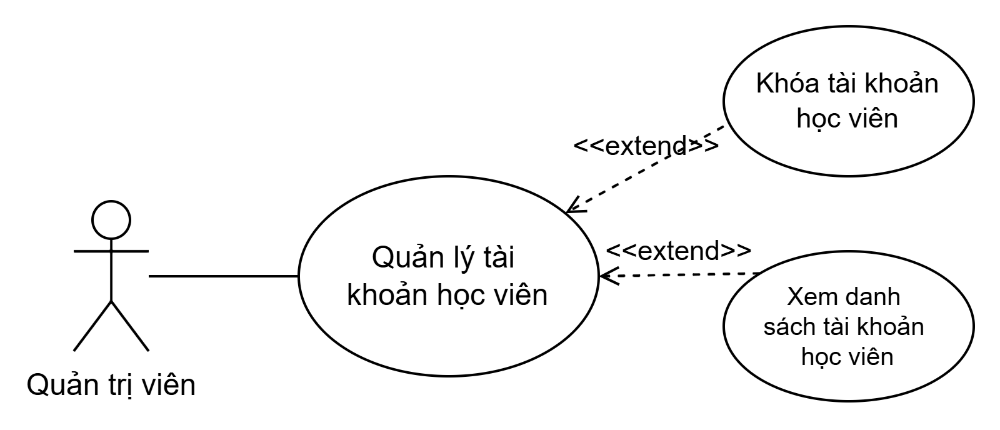

### Hình 3.X+7. Sơ đồ Use Case Quản lý tài khoản học viên

| Tên               | Xem danh sách tài khoản học viên                                                                                                                                                                                                                                                                                                         |
|-------------------|------------------------------------------------------------------------------------------------------------------------------------------------------------------------------------------------------------------------------------------------------------------------------------------------------------------------------------------|
| Mô tả             | Cho phép Quản trị viên xem toàn bộ danh sách tài khoản học viên trong hệ thống, hỗ trợ tìm kiếm và lọc theo các tiêu chí.                                                                                                                                                                                                                |
| Tác nhân          | Quản trị viên                                                                                                                                                                                                                                                                                                                            |
| Tiền điều kiện    | Quản trị viên đã đăng nhập vào hệ thống.                                                                                                                                                                                                                                                                                                 |
| Luồng cơ sở       | #### 1. Quản trị viên truy cập trang Quản lý tài khoản học viên.  #### 2. Hệ thống hiển thị danh sách học viên gồm: họ tên, email, ngày đăng ký, trạng thái tài khoản.  #### 3. Quản trị viên có thể tìm kiếm theo tên hoặc email, hoặc lọc theo trạng thái tài khoản.  #### 4. Hệ thống cập nhật danh sách theo điều kiện lọc/tìm kiếm. |
| Luồng thay thế    | -                                                                                                                                                                                                                                                                                                                                        |
| Luồng ngoại lệ    | -                                                                                                                                                                                                                                                                                                                                        |
| Hậu điều kiện     | Danh sách tài khoản học viên được hiển thị đầy đủ theo điều kiện lọc.                                                                                                                                                                                                                                                                    |
| Quy tắc nghiệp vụ | -                                                                                                                                                                                                                                                                                                                                        |

### Bảng 3.X+12. Đặc tả Use Case Xem danh sách học viên

| Tên               | Khóa / Mở khóa tài khoản học viên                                                                                                                                                                                                                                                                                                                                                                                                                                                                                                                                                                                                                                                                                         |
|-------------------|---------------------------------------------------------------------------------------------------------------------------------------------------------------------------------------------------------------------------------------------------------------------------------------------------------------------------------------------------------------------------------------------------------------------------------------------------------------------------------------------------------------------------------------------------------------------------------------------------------------------------------------------------------------------------------------------------------------------------|
| Mô tả             | Cho phép Quản trị viên khóa tài khoản học viên vi phạm hoặc mở khóa tài khoản đã bị khóa trước đó.                                                                                                                                                                                                                                                                                                                                                                                                                                                                                                                                                                                                                        |
| Tác nhân          | Quản trị viên                                                                                                                                                                                                                                                                                                                                                                                                                                                                                                                                                                                                                                                                                                             |
| Tiền điều kiện    | Quản trị viên đã đăng nhập vào hệ thống.                                                                                                                                                                                                                                                                                                                                                                                                                                                                                                                                                                                                                                                                                  |
| Luồng cơ sở       | #### 1. Quản trị viên truy cập trang chi tiết tài khoản học viên cần thao tác.  #### 2. Quản trị viên chọn "Khóa tài khoản" hoặc "Mở khóa tài khoản" tùy trạng thái hiện tại.  #### [Khóa tài khoản]  #### 3. Hệ thống hiển thị hộp thoại yêu cầu nhập lý do khóa.  #### 4. Quản trị viên nhập lý do và xác nhận.  #### 5. Hệ thống cập nhật trạng thái tài khoản thành "Bị khóa" và lưu lịch sử.  #### 6. Hệ thống hiển thị thông báo khóa tài khoản thành công.  #### [Mở khóa tài khoản]  #### 3. Hệ thống hiển thị hộp thoại xác nhận mở khóa.  #### 4. Quản trị viên xác nhận.  #### 5. Hệ thống cập nhật trạng thái tài khoản thành "Hoạt động".  #### 6. Hệ thống hiển thị thông báo mở khóa tài khoản thành công. |
| Luồng thay thế    | -                                                                                                                                                                                                                                                                                                                                                                                                                                                                                                                                                                                                                                                                                                                         |
| Luồng ngoại lệ    | -                                                                                                                                                                                                                                                                                                                                                                                                                                                                                                                                                                                                                                                                                                                         |
| Hậu điều kiện     | #### Trạng thái tài khoản học viên được cập nhật trong cơ sở dữ liệu.  #### Lịch sử khóa/mở khóa được lưu kèm lý do, thời gian và người thực hiện.                                                                                                                                                                                                                                                                                                                                                                                                                                                                                                                                                                        |
| Quy tắc nghiệp vụ | #### - Học viên bị khóa không thể đăng nhập vào hệ thống.  #### - Quản trị viên phải nhập lý do khi khóa tài khoản.                                                                                                                                                                                                                                                                                                                                                                                                                                                                                                                                                                                                       |

### Bảng 3.X+14. Đặc tả Use Case Khóa / Mở khóa tài khoản học viên

### 3.2.1.2.1. Sơ đồ Use Case Quản lý khóa học

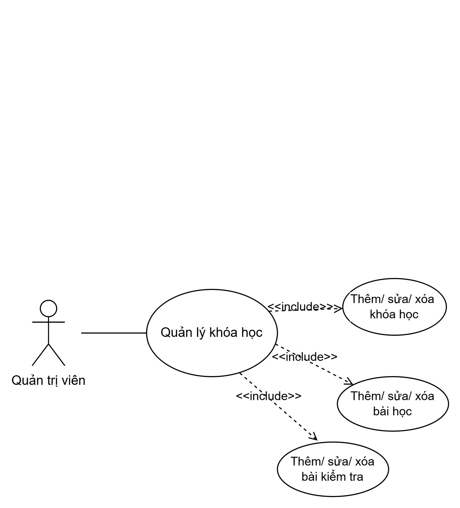

### Hình 3.X+8. Sơ đồ Use Case Quản lý khóa học

| Tên               | Thêm / Sửa / Xóa khóa học                                                                                                                                                                                                                                                                                                                                                                                                                                                                                                                                                                                                                                                                                                                                                                                                                                                                                                                                                                                                                                                                                                                       |
|-------------------|-------------------------------------------------------------------------------------------------------------------------------------------------------------------------------------------------------------------------------------------------------------------------------------------------------------------------------------------------------------------------------------------------------------------------------------------------------------------------------------------------------------------------------------------------------------------------------------------------------------------------------------------------------------------------------------------------------------------------------------------------------------------------------------------------------------------------------------------------------------------------------------------------------------------------------------------------------------------------------------------------------------------------------------------------------------------------------------------------------------------------------------------------|
| Mô tả             | Cho phép Quản trị viên tạo mới, chỉnh sửa thông tin và xóa khóa học khỏi hệ thống. Quản trị viên cũng có thể xuất bản hoặc ẩn khóa học.                                                                                                                                                                                                                                                                                                                                                                                                                                                                                                                                                                                                                                                                                                                                                                                                                                                                                                                                                                                                         |
| Tác nhân          | Quản trị viên                                                                                                                                                                                                                                                                                                                                                                                                                                                                                                                                                                                                                                                                                                                                                                                                                                                                                                                                                                                                                                                                                                                                   |
| Tiền điều kiện    | Quản trị viên đã đăng nhập vào hệ thống.                                                                                                                                                                                                                                                                                                                                                                                                                                                                                                                                                                                                                                                                                                                                                                                                                                                                                                                                                                                                                                                                                                        |
| Luồng cơ sở       | #### 1. Quản trị viên truy cập chức năng Quản lý khóa học.  #### 2. Hệ thống hiển thị danh sách tất cả khóa học.  #### 3. Quản trị viên chọn một trong các thao tác: Thêm, Sửa hoặc Xóa khóa học.  #### [Thêm khóa học]  #### 4. Quản trị viên nhập thông tin khóa học: tên, mô tả, danh mục, ảnh bìa, cấp độ.  #### 5. Quản trị viên nhấn Lưu.  #### 6. Hệ thống kiểm tra dữ liệu hợp lệ.  #### 7. Hệ thống tạo khóa học mới với trạng thái "Bản nháp" và thông báo thành công.  #### [Sửa khóa học]  #### 4. Quản trị viên chọn khóa học cần chỉnh sửa.  #### 5. Hệ thống hiển thị form với dữ liệu hiện tại.  #### 6. Quản trị viên cập nhật thông tin và nhấn Lưu.  #### 7. Hệ thống cập nhật dữ liệu và thông báo thành công.  #### [Xóa khóa học]  #### 4. Quản trị viên chọn khóa học cần xóa.  #### 5. Hệ thống hiển thị hộp thoại xác nhận.  #### 6. Quản trị viên xác nhận xóa.  #### 7. Hệ thống xóa khóa học và thông báo thành công.  #### [Xuất bản / Ẩn khóa học]  #### 4. Quản trị viên chọn trạng thái "Xuất bản" hoặc "Ẩn" cho khóa học.  #### 5. Hệ thống cập nhật trạng thái và phản ánh ngay lập tức trên trang công khai. |
| Luồng thay thế    | #### [Dữ liệu không hợp lệ]  #### Tại bước kiểm tra, nếu thông tin nhập vào không đúng định dạng hoặc thiếu trường bắt buộc, hệ thống hiển thị thông báo lỗi tương ứng.  #### Use Case quay lại bước nhập thông tin.                                                                                                                                                                                                                                                                                                                                                                                                                                                                                                                                                                                                                                                                                                                                                                                                                                                                                                                            |
| Luồng ngoại lệ    | #### [Xóa khóa học đã có học viên đăng ký]  #### Hệ thống hiển thị thông báo: "Không thể xóa khóa học đã có học viên đăng ký. Vui lòng ẩn khóa học thay vì xóa."  #### Use Case dừng lại.                                                                                                                                                                                                                                                                                                                                                                                                                                                                                                                                                                                                                                                                                                                                                                                                                                                                                                                                                       |
| Hậu điều kiện     | Thông tin khóa học được lưu, cập nhật hoặc xóa thành công trong cơ sở dữ liệu.                                                                                                                                                                                                                                                                                                                                                                                                                                                                                                                                                                                                                                                                                                                                                                                                                                                                                                                                                                                                                                                                  |
| Quy tắc nghiệp vụ | #### - Tên khóa học không được trùng trong hệ thống.  #### - Không được xóa khóa học đã có học viên đăng ký.                                                                                                                                                                                                                                                                                                                                                                                                                                                                                                                                                                                                                                                                                                                                                                                                                                                                                                                                                                                                                                    |

### Bảng 3.X+15. Đặc tả Use Case Thêm / Sửa / Xóa khóa học

### c

| Tên               | Thêm / Sửa / Xóa bài học                                                                                                                                                                                                                                                                                                                                                                                                                                                                                                                                                                                                                                                                                                                                                                                                                                                                                                                                                                                                       |
|-------------------|--------------------------------------------------------------------------------------------------------------------------------------------------------------------------------------------------------------------------------------------------------------------------------------------------------------------------------------------------------------------------------------------------------------------------------------------------------------------------------------------------------------------------------------------------------------------------------------------------------------------------------------------------------------------------------------------------------------------------------------------------------------------------------------------------------------------------------------------------------------------------------------------------------------------------------------------------------------------------------------------------------------------------------|
| Mô tả             | Cho phép Quản trị viên quản lý nội dung bài học bên trong một khóa học, bao gồm thêm mới, chỉnh sửa, xóa bài học và tải lên video/tài liệu học tập.                                                                                                                                                                                                                                                                                                                                                                                                                                                                                                                                                                                                                                                                                                                                                                                                                                                                            |
| Tác nhân          | Quản trị viên                                                                                                                                                                                                                                                                                                                                                                                                                                                                                                                                                                                                                                                                                                                                                                                                                                                                                                                                                                                                                  |
| Tiền điều kiện    | #### Quản trị viên đã đăng nhập vào hệ thống.  #### Khóa học chứa bài học đã được tạo trong hệ thống.                                                                                                                                                                                                                                                                                                                                                                                                                                                                                                                                                                                                                                                                                                                                                                                                                                                                                                                          |
| Luồng cơ sở       | #### 1. Quản trị viên truy cập trang chi tiết khóa học cần quản lý bài học.  #### 2. Hệ thống hiển thị danh sách bài học hiện có.  #### 3. Quản trị viên chọn thao tác: Thêm, Sửa hoặc Xóa bài học.  #### [Thêm bài học]  #### 4. Quản trị viên nhập thông tin bài học: tiêu đề, mô tả, thứ tự.  #### 5. Quản trị viên tải lên video và tài liệu đính kèm (nếu có).  #### 6. Quản trị viên nhấn Lưu.  #### 7. Hệ thống kiểm tra dữ liệu hợp lệ và lưu bài học.  #### [Sửa bài học]  #### 4. Quản trị viên chọn bài học cần chỉnh sửa.  #### 5. Hệ thống hiển thị form với dữ liệu hiện tại.  #### 6. Quản trị viên cập nhật thông tin và nhấn Lưu.  #### 7. Hệ thống cập nhật và thông báo thành công.  #### [Xóa bài học]  #### 4. Quản trị viên chọn bài học cần xóa.  #### 5. Hệ thống hiển thị hộp thoại xác nhận.  #### 6. Quản trị viên xác nhận và hệ thống xóa bài học.  #### [Sắp xếp thứ tự bài học]  #### 4. Quản trị viên kéo thả để sắp xếp lại thứ tự bài học.  #### 5. Hệ thống cập nhật thứ tự và lưu tự động. |
| Luồng thay thế    | -                                                                                                                                                                                                                                                                                                                                                                                                                                                                                                                                                                                                                                                                                                                                                                                                                                                                                                                                                                                                                              |
| Luồng ngoại lệ    | #### [File video không đúng định dạng hoặc quá dung lượng]  #### Hệ thống hiển thị thông báo lỗi và yêu cầu tải lại file hợp lệ.  #### Use Case quay lại bước tải lên file.                                                                                                                                                                                                                                                                                                                                                                                                                                                                                                                                                                                                                                                                                                                                                                                                                                                    |
| Hậu điều kiện     | Bài học được thêm mới, cập nhật hoặc xóa thành công trong cơ sở dữ liệu.                                                                                                                                                                                                                                                                                                                                                                                                                                                                                                                                                                                                                                                                                                                                                                                                                                                                                                                                                       |
| Quy tắc nghiệp vụ | #### - Tiêu đề bài học không được để trống.  #### - Thứ tự bài học quyết định trình tự hiển thị với học viên.                                                                                                                                                                                                                                                                                                                                                                                                                                                                                                                                                                                                                                                                                                                                                                                                                                                                                                                  |

### Bảng 3.X+16. Đặc tả Use Case Thêm / Sửa / Xóa bài học

| Tên               | Tạo / Chỉnh sửa / Xóa bài kiểm tra                                                                                                                                                                                                                                                                                                                                                                                                                                                                                                                                                                                                                                                                                                                        |
|-------------------|-----------------------------------------------------------------------------------------------------------------------------------------------------------------------------------------------------------------------------------------------------------------------------------------------------------------------------------------------------------------------------------------------------------------------------------------------------------------------------------------------------------------------------------------------------------------------------------------------------------------------------------------------------------------------------------------------------------------------------------------------------------|
| Mô tả             | Cho phép Quản trị viên tạo mới, chỉnh sửa hoặc xóa bài kiểm tra cuối khóa, đồng thời cấu hình các thông số như điểm đạt và số lần làm bài tối đa.                                                                                                                                                                                                                                                                                                                                                                                                                                                                                                                                                                                                         |
| Tác nhân          | Quản trị viên                                                                                                                                                                                                                                                                                                                                                                                                                                                                                                                                                                                                                                                                                                                                             |
| Tiền điều kiện    | #### Quản trị viên đã đăng nhập vào hệ thống.  #### Khóa học tương ứng đã được tạo trong hệ thống.                                                                                                                                                                                                                                                                                                                                                                                                                                                                                                                                                                                                                                                        |
| Luồng cơ sở       | #### 1. Quản trị viên truy cập trang chi tiết khóa học và chọn mục Quản lý bài kiểm tra.  #### 2. Hệ thống hiển thị thông tin bài kiểm tra hiện có (nếu có).  #### 3. Quản trị viên chọn thao tác: Tạo mới, Chỉnh sửa hoặc Xóa.  #### [Tạo bài kiểm tra]  #### 4. Quản trị viên nhập: tên bài kiểm tra, thời gian làm bài (phút), điểm đạt yêu cầu (%), số lần làm tối đa.  #### 5. Quản trị viên nhấn Lưu.  #### 6. Hệ thống lưu cấu hình bài kiểm tra và thông báo thành công.  #### [Chỉnh sửa bài kiểm tra]  #### 4. Quản trị viên chỉnh sửa thông số và nhấn Lưu.  #### 5. Hệ thống cập nhật và thông báo thành công.  #### [Xóa bài kiểm tra]  #### 4. Quản trị viên xác nhận xóa.  #### 5. Hệ thống xóa bài kiểm tra và toàn bộ câu hỏi liên quan. |
| Luồng thay thế    | -                                                                                                                                                                                                                                                                                                                                                                                                                                                                                                                                                                                                                                                                                                                                                         |
| Luồng ngoại lệ    | -                                                                                                                                                                                                                                                                                                                                                                                                                                                                                                                                                                                                                                                                                                                                                         |
| Hậu điều kiện     | Bài kiểm tra được tạo, cập nhật hoặc xóa thành công trong cơ sở dữ liệu.                                                                                                                                                                                                                                                                                                                                                                                                                                                                                                                                                                                                                                                                                  |
| Quy tắc nghiệp vụ | #### - Mỗi khóa học chỉ có một bài kiểm tra cuối khóa.  #### - Điểm đạt yêu cầu mặc định là 75%.                                                                                                                                                                                                                                                                                                                                                                                                                                                                                                                                                                                                                                                          |

### Bảng 3.X+18. Đặc tả Use Case Tạo / Chỉnh sửa / Xóa bài kiểm tra

### 3.2.1.2.1. Sơ đồ Use Case Quản lý danh mục khóa học

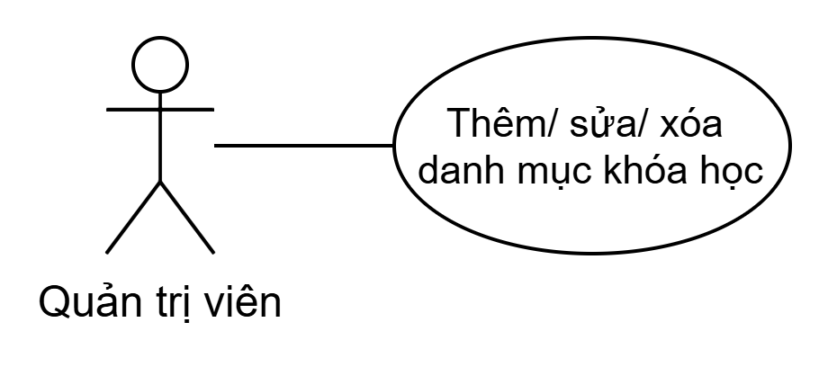

### Hình 3.X+9. Sơ đồ Use Case Quản lý danh mục khóa học

| Tên               | Thêm / Sửa / Xóa danh mục khóa học                                                                                                                                                                                                                                                                                                                                                                                                                                                                                                                                                                                                                                                                                                                                                                           |
|-------------------|--------------------------------------------------------------------------------------------------------------------------------------------------------------------------------------------------------------------------------------------------------------------------------------------------------------------------------------------------------------------------------------------------------------------------------------------------------------------------------------------------------------------------------------------------------------------------------------------------------------------------------------------------------------------------------------------------------------------------------------------------------------------------------------------------------------|
| Mô tả             | Cho phép Quản trị viên tạo mới, chỉnh sửa và xóa các danh mục khóa học dùng để phân loại nội dung học tập trên hệ thống.                                                                                                                                                                                                                                                                                                                                                                                                                                                                                                                                                                                                                                                                                     |
| Tác nhân          | Quản trị viên                                                                                                                                                                                                                                                                                                                                                                                                                                                                                                                                                                                                                                                                                                                                                                                                |
| Tiền điều kiện    | Quản trị viên đã đăng nhập vào hệ thống.                                                                                                                                                                                                                                                                                                                                                                                                                                                                                                                                                                                                                                                                                                                                                                     |
| Luồng cơ sở       | #### 1. Quản trị viên truy cập chức năng Quản lý danh mục.  #### 2. Hệ thống hiển thị danh sách danh mục hiện có.  #### 3. Quản trị viên chọn thao tác: Thêm, Sửa hoặc Xóa danh mục.  #### [Thêm danh mục]  #### 4. Quản trị viên nhập tên và mô tả danh mục.  #### 5. Quản trị viên nhấn Lưu.  #### 6. Hệ thống kiểm tra tên danh mục không trùng.  #### 7. Hệ thống lưu danh mục mới và thông báo thành công.  #### [Sửa danh mục]  #### 4. Quản trị viên chọn danh mục cần sửa.  #### 5. Quản trị viên cập nhật thông tin và nhấn Lưu.  #### 6. Hệ thống cập nhật và thông báo thành công.  #### [Xóa danh mục]  #### 4. Quản trị viên chọn danh mục cần xóa.  #### 5. Hệ thống hiển thị hộp thoại xác nhận.  #### 6. Quản trị viên xác nhận xóa.  #### 7. Hệ thống xóa danh mục và thông báo thành công. |
| Luồng thay thế    | -                                                                                                                                                                                                                                                                                                                                                                                                                                                                                                                                                                                                                                                                                                                                                                                                            |
| Luồng ngoại lệ    | #### [Tên danh mục đã tồn tại]  #### Tại bước kiểm tra, hệ thống hiển thị thông báo: "Tên danh mục đã tồn tại. Vui lòng nhập tên khác."  #### Use Case quay lại bước nhập thông tin.  ####   #### [Xóa danh mục còn chứa khóa học]  #### Hệ thống hiển thị thông báo: "Không thể xóa danh mục đang chứa khóa học."  #### Use Case dừng lại.                                                                                                                                                                                                                                                                                                                                                                                                                                                                  |
| Hậu điều kiện     | Danh mục khóa học được thêm mới, cập nhật hoặc xóa thành công trong cơ sở dữ liệu.                                                                                                                                                                                                                                                                                                                                                                                                                                                                                                                                                                                                                                                                                                                           |
| Quy tắc nghiệp vụ | #### - Tên danh mục phải là duy nhất trong hệ thống.  #### - Không được xóa danh mục đang chứa khóa học.                                                                                                                                                                                                                                                                                                                                                                                                                                                                                                                                                                                                                                                                                                     |

### Bảng 3.X+17. Đặc tả Use Case Thêm / Sửa / Xóa danh mục khóa học

| Tên               | Thêm / Sửa / Xóa câu hỏi và đáp án                                                                                                                                                                                                                                                                                                                                                                                                                                                                                                                                                                                                                                                                                                                                                                               |
|-------------------|------------------------------------------------------------------------------------------------------------------------------------------------------------------------------------------------------------------------------------------------------------------------------------------------------------------------------------------------------------------------------------------------------------------------------------------------------------------------------------------------------------------------------------------------------------------------------------------------------------------------------------------------------------------------------------------------------------------------------------------------------------------------------------------------------------------|
| Mô tả             | Cho phép Quản trị viên quản lý ngân hàng câu hỏi trong bài kiểm tra, bao gồm thêm mới, chỉnh sửa và xóa câu hỏi trắc nghiệm cùng các đáp án tương ứng.                                                                                                                                                                                                                                                                                                                                                                                                                                                                                                                                                                                                                                                           |
| Tác nhân          | Quản trị viên                                                                                                                                                                                                                                                                                                                                                                                                                                                                                                                                                                                                                                                                                                                                                                                                    |
| Tiền điều kiện    | #### Quản trị viên đã đăng nhập vào hệ thống.  #### Bài kiểm tra đã được tạo trong hệ thống.                                                                                                                                                                                                                                                                                                                                                                                                                                                                                                                                                                                                                                                                                                                     |
| Luồng cơ sở       | #### 1. Quản trị viên truy cập trang quản lý câu hỏi của bài kiểm tra.  #### 2. Hệ thống hiển thị danh sách câu hỏi hiện có.  #### 3. Quản trị viên chọn thao tác: Thêm, Sửa hoặc Xóa câu hỏi.  #### [Thêm câu hỏi]  #### 4. Quản trị viên nhập nội dung câu hỏi.  #### 5. Quản trị viên nhập các đáp án (tối thiểu 2, tối đa 4) và đánh dấu đáp án đúng.  #### 6. Quản trị viên nhấn Lưu.  #### 7. Hệ thống kiểm tra dữ liệu hợp lệ và lưu câu hỏi.  #### [Sửa câu hỏi]  #### 4. Quản trị viên chọn câu hỏi cần sửa.  #### 5. Quản trị viên cập nhật nội dung và đáp án, nhấn Lưu.  #### 6. Hệ thống cập nhật và thông báo thành công.  #### [Xóa câu hỏi]  #### 4. Quản trị viên chọn câu hỏi cần xóa.  #### 5. Hệ thống hiển thị hộp thoại xác nhận.  #### 6. Quản trị viên xác nhận và hệ thống xóa câu hỏi. |
| Luồng thay thế    | -                                                                                                                                                                                                                                                                                                                                                                                                                                                                                                                                                                                                                                                                                                                                                                                                                |
| Luồng ngoại lệ    | #### [Câu hỏi chưa có đáp án đúng]  #### Tại bước kiểm tra dữ liệu, nếu không có đáp án nào được đánh dấu là đúng, hệ thống hiển thị thông báo: "Vui lòng chọn đáp án đúng cho câu hỏi."  #### Use Case quay lại bước nhập đáp án.                                                                                                                                                                                                                                                                                                                                                                                                                                                                                                                                                                               |
| Hậu điều kiện     | Câu hỏi và đáp án được thêm mới, cập nhật hoặc xóa thành công trong cơ sở dữ liệu.                                                                                                                                                                                                                                                                                                                                                                                                                                                                                                                                                                                                                                                                                                                               |
| Quy tắc nghiệp vụ | #### - Mỗi câu hỏi phải có tối thiểu 2 đáp án và đúng một đáp án đúng.  #### - Nội dung câu hỏi không được để trống.  #### - Bài kiểm tra cần có tối thiểu 5 câu hỏi mới có thể sử dụng.                                                                                                                                                                                                                                                                                                                                                                                                                                                                                                                                                                                                                         |

### Bảng 3.X+19. Đặc tả Use Case Thêm / Sửa / Xóa câu hỏi và đáp án

### 3.2.1.2.1. Sơ đồ Use Case Quản lý đánh giá khóa học

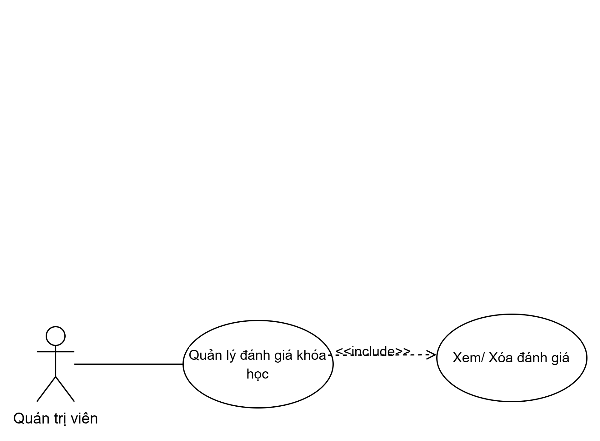

### Hình 3.X+11. Sơ đồ Use Case Quản lý đánh giá khóa học

| Tên               | Xem và xóa đánh giá khóa học                                                                                                                                                                                                                                                                                                                                                                                                                          |
|-------------------|-------------------------------------------------------------------------------------------------------------------------------------------------------------------------------------------------------------------------------------------------------------------------------------------------------------------------------------------------------------------------------------------------------------------------------------------------------|
| Mô tả             | Cho phép Quản trị viên xem toàn bộ đánh giá của học viên đối với các khóa học và xóa các đánh giá vi phạm chính sách nội dung.                                                                                                                                                                                                                                                                                                                        |
| Tác nhân          | Quản trị viên                                                                                                                                                                                                                                                                                                                                                                                                                                         |
| Tiền điều kiện    | Quản trị viên đã đăng nhập vào hệ thống.                                                                                                                                                                                                                                                                                                                                                                                                              |
| Luồng cơ sở       | #### 1. Quản trị viên truy cập trang Quản lý đánh giá khóa học.  #### 2. Hệ thống hiển thị danh sách đánh giá gồm: tên học viên, tên khóa học, số sao, nội dung nhận xét, ngày đánh giá.  #### 3. Quản trị viên xem chi tiết đánh giá.  #### 4. Quản trị viên chọn xóa đánh giá vi phạm.  #### 5. Hệ thống hiển thị hộp thoại xác nhận.  #### 6. Quản trị viên xác nhận xóa.  #### 7. Hệ thống xóa đánh giá và cập nhật điểm trung bình của khóa học. |
| Luồng thay thế    | #### [Lọc đánh giá theo khóa học]  #### Tại bước 2, Quản trị viên chọn một khóa học cụ thể.  #### Hệ thống chỉ hiển thị đánh giá thuộc khóa học đó.                                                                                                                                                                                                                                                                                                   |
| Luồng ngoại lệ    | -                                                                                                                                                                                                                                                                                                                                                                                                                                                     |
| Hậu điều kiện     | #### Đánh giá vi phạm được xóa khỏi hệ thống.  #### Điểm đánh giá trung bình của khóa học được cập nhật lại.                                                                                                                                                                                                                                                                                                                                          |
| Quy tắc nghiệp vụ | - Chỉ Quản trị viên mới có quyền xóa đánh giá.                                                                                                                                                                                                                                                                                                                                                                                                        |

### Bảng 3.X+20. Đặc tả Use Case Xem và xóa đánh giá khóa học

### 3.2.1.2.1. Sơ đồ Use Case Xem báo cáo thống kê

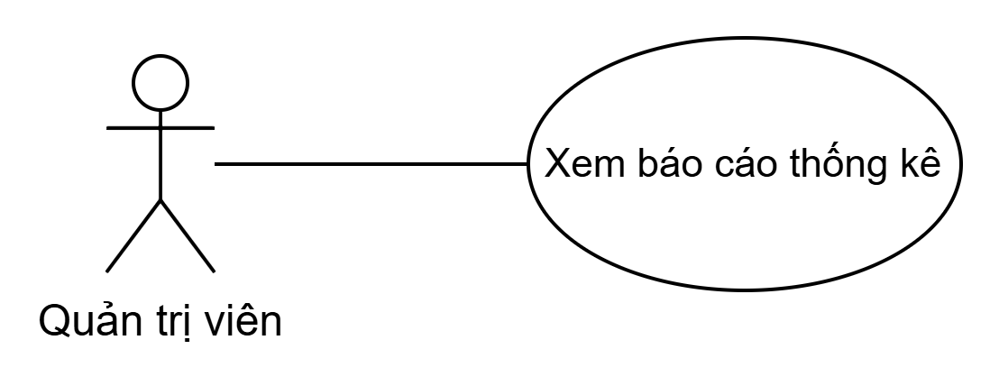

### Hình 3.X+12. Sơ đồ Use Case Xem báo cáo thống kê

| Tên               | Xem dashboard và báo cáo thống kê                                                                                                                                                                                                                                                                                                                                                                                                                                                           |
|-------------------|---------------------------------------------------------------------------------------------------------------------------------------------------------------------------------------------------------------------------------------------------------------------------------------------------------------------------------------------------------------------------------------------------------------------------------------------------------------------------------------------|
| Mô tả             | Cho phép Quản trị viên xem tổng quan hoạt động hệ thống qua dashboard bao gồm: số lượng học viên, khóa học, tỷ lệ hoàn thành và thống kê theo thời gian.                                                                                                                                                                                                                                                                                                                                    |
| Tác nhân          | Quản trị viên                                                                                                                                                                                                                                                                                                                                                                                                                                                                               |
| Tiền điều kiện    | Quản trị viên đã đăng nhập vào hệ thống.                                                                                                                                                                                                                                                                                                                                                                                                                                                    |
| Luồng cơ sở       | #### 1. Quản trị viên truy cập trang Dashboard quản trị.  #### 2. Hệ thống tải và hiển thị các chỉ số tổng quan:  #### - Tổng số học viên đăng ký.  #### - Tổng số khóa học đang hoạt động.  #### - Tổng số lượt đăng ký khóa học.  #### - Tỷ lệ hoàn thành khóa học trung bình.  #### 3. Hệ thống hiển thị biểu đồ học viên đăng ký theo thời gian.  #### 4. Hệ thống hiển thị danh sách khóa học có nhiều học viên nhất.  #### 5. Quản trị viên có thể lọc dữ liệu theo khoảng thời gian. |
| Luồng thay thế    | #### [Lọc theo khoảng thời gian]  #### Tại bước 5, Quản trị viên chọn khoảng thời gian (tuần/tháng/năm).  #### Hệ thống cập nhật tất cả số liệu theo khoảng thời gian đã chọn.                                                                                                                                                                                                                                                                                                              |
| Luồng ngoại lệ    | -                                                                                                                                                                                                                                                                                                                                                                                                                                                                                           |
| Hậu điều kiện     | Dashboard và báo cáo thống kê được hiển thị đầy đủ theo yêu cầu.                                                                                                                                                                                                                                                                                                                                                                                                                            |
| Quy tắc nghiệp vụ | #### - Chỉ Quản trị viên mới có quyền truy cập dashboard.  #### - Dữ liệu thống kê được tính toán real-time từ cơ sở dữ liệu.                                                                                                                                                                                                                                                                                                                                                               |

### Bảng 3.X+21. Đặc tả Use Case Xem dashboard và báo cáo thống kê

### 3.2.1.2.1. Sơ đồ Use Case Quản lý blog tin tức

### Hình 3.X+12. Sơ đồ Use Case Quản lý blog tin tức

| Tên               | Quản lý blog tin tức                                                                                                                                                                                                                                                                                                                                                                                                                   |
|-------------------|----------------------------------------------------------------------------------------------------------------------------------------------------------------------------------------------------------------------------------------------------------------------------------------------------------------------------------------------------------------------------------------------------------------------------------------|
| Mô tả             | Cho phép Quản trị viên tạo, chỉnh sửa và xóa các bài viết tin tức liên quan đến thị trường marketing, giới thiệu công ty, chính sách và FAQ.                                                                                                                                                                                                                                                                                           |
| Tác nhân          | Quản trị viên                                                                                                                                                                                                                                                                                                                                                                                                                          |
| Tiền điều kiện    | Quản trị viên đã đăng nhập vào hệ thống.                                                                                                                                                                                                                                                                                                                                                                                               |
| Luồng cơ sở       | #### 1. Quản trị viên truy cập chức năng Quản lý blog tin tức.  #### 2. Hệ thống hiển thị danh sách bài viết hiện có.  #### 3. Quản trị viên chọn "Thêm bài viết mới".  #### 4. Hệ thống hiển thị form gồm: tiêu đề, danh mục (Tin tức marketing / Giới thiệu công ty / Chính sách / FAQ), nội dung, ảnh thumbnail.  #### 5. Quản trị viên nhập nội dung và nhấn Lưu.  #### 6. Hệ thống lưu bài viết và hiển thị thông báo thành công. |
| Luồng thay thế    | #### [Sửa bài viết]  #### Quản trị viên chọn bài viết cần sửa, cập nhật nội dung và nhấn Lưu. Hệ thống cập nhật và thông báo thành công.  ####   #### [Xóa bài viết]  #### Quản trị viên chọn bài viết cần xóa, xác nhận trong hộp thoại. Hệ thống xóa bài viết.                                                                                                                                                                       |
| Luồng ngoại lệ    | -                                                                                                                                                                                                                                                                                                                                                                                                                                      |
| Hậu điều kiện     | Bài viết được tạo/cập nhật/xóa thành công trong cơ sở dữ liệu, hoặc nội dung bài viết được hiển thị đến người đọc.                                                                                                                                                                                                                                                                                                                     |
| Quy tắc nghiệp vụ | -                                                                                                                                                                                                                                                                                                                                                                                                                                      |

### Bảng 3.X+21. Đặc tả Use Case Xem dashboard và báo cáo thống kê

### 3.2.2. Sơ đồ Activity

#### 3.2.2.1. Sơ đồ Activity quy trình học viên thanh toán khóa học

Học viên bắt đầu bằng cách gửi yêu cầu mua khóa học, sau đó tiến hành xác nhận đơn hàng trên trang hiển thị của hệ thống. Học viên chọn phương thức thanh toán bằng cách nhập thông tin thẻ xác thực OTP hoặc quét mã QR, hệ thống sẽ kết nối với cổng thanh toán để xử lý và kiểm tra kết quả giao dịch. Nếu thanh toán thành công, đơn hàng được cập nhật, đồng thời khóa học được kích hoạt tạo Enrollment với thời hạn sử dụng trong 1 năm và hệ thống gửi thông báo xác nhận kèm hóa đơn cho học viên. Nếu thanh toán thất bại, hệ thống sẽ hiển thị thông báo lỗi để học viên lựa chọn thực hiện thử lại hoặc hủy bỏ quy trình.

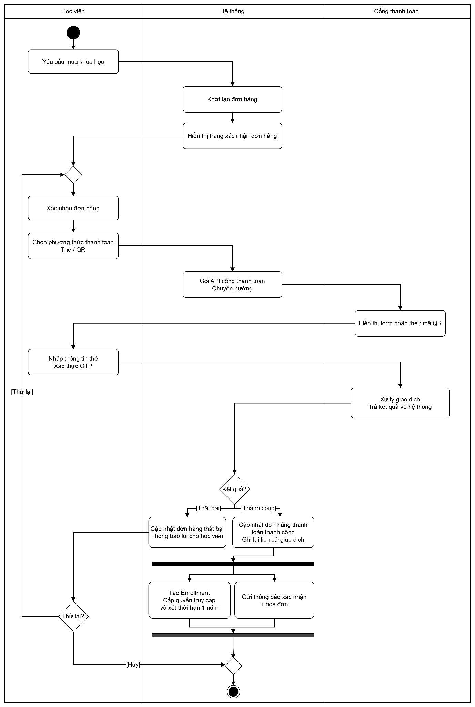

##### Hình 3.1. Sơ đồ Activity về quy trình học viên thanh toán khóa học

#### 3.2.2.2. Sơ đồ Activity quy trình học viên học trực tuyến

Học viên bắt đầu bằng cách truy cập website và đăng nhập, sau đó tìm kiếm, xem chi tiết khóa học. Học viên chọn cách thanh toán bằng nhập mã số thẻ hoặc quét QR code ngân hàng, khóa học được kích hoạt nhưng sẽ hết hạn sau 1 năm. Khi học viên hoàn thành hết các phần, nếu bài thi đạt &gt;=75%, học viên phải đánh giá khóa học để được nhận chứng chỉ. Nếu chưa đạt, học viên sẽ được thông báo để tiếp tục thi lại.

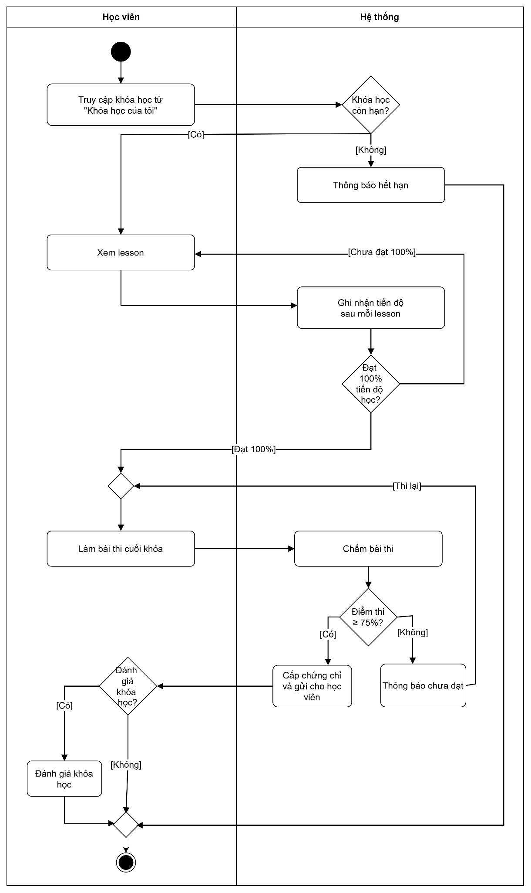

##### Hình 3.2. Sơ đồ Activity về quy trình học viên học trực tuyến

#### 3.2.2.1. Sơ đồ hoạt động quy trình QTV thêm mới khóa học

Quản trị viên (QTV) bắt đầu bằng cách nhấn nút tạo khóa học mới, hệ thống sẽ hiển thị form để nhập các thông tin cơ bản và nhấn lưu nháp. Nếu dữ liệu hợp lệ, khóa học được lưu ở trạng thái DRAFT; ngược lại, hệ thống sẽ thông báo lỗi. Tiếp theo, QTV tạo nội dung bài học bằng cách nhập tiêu đề, upload video/tài liệu và nhấn lưu; hệ thống kiểm tra file và lưu bài học nếu hợp lệ hoặc báo lỗi nếu không hợp lệ. Sau khi hoàn tất thêm bài học, QTV chuyển sang tab bài kiểm tra để tạo bài kiểm tra và lần lượt nhập nội dung câu hỏi, đáp án, đánh dấu đáp án đúng rồi lưu lại. Cuối cùng, QTV kiểm tra lại toàn bộ nội dung và nhấn xuất bản, hệ thống sẽ cập nhật trạng thái khóa học sang PUBLISHED và hiển thị thông báo thành công.

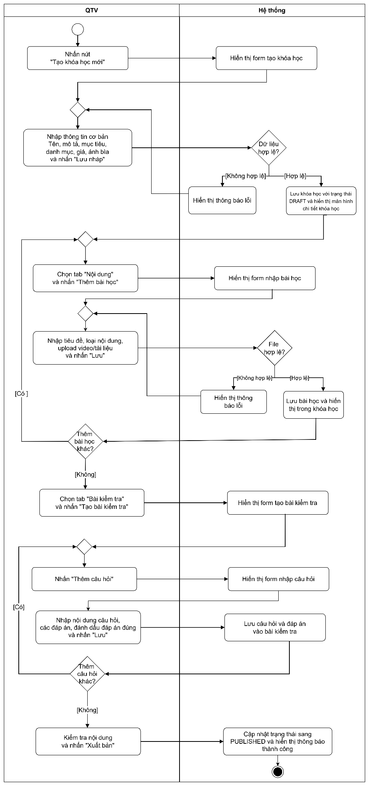

##### Hình 3.26. Sơ đồ hoạt động thêm mới khóa học

#### 3.2.3.1. Sơ đồ tuần tự học viên học trực tuyến

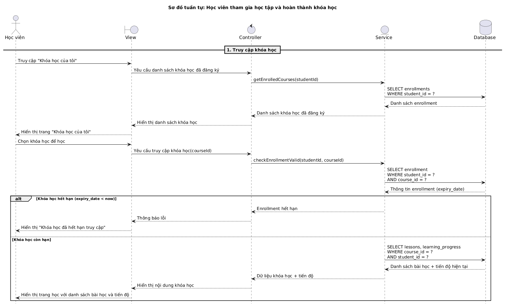

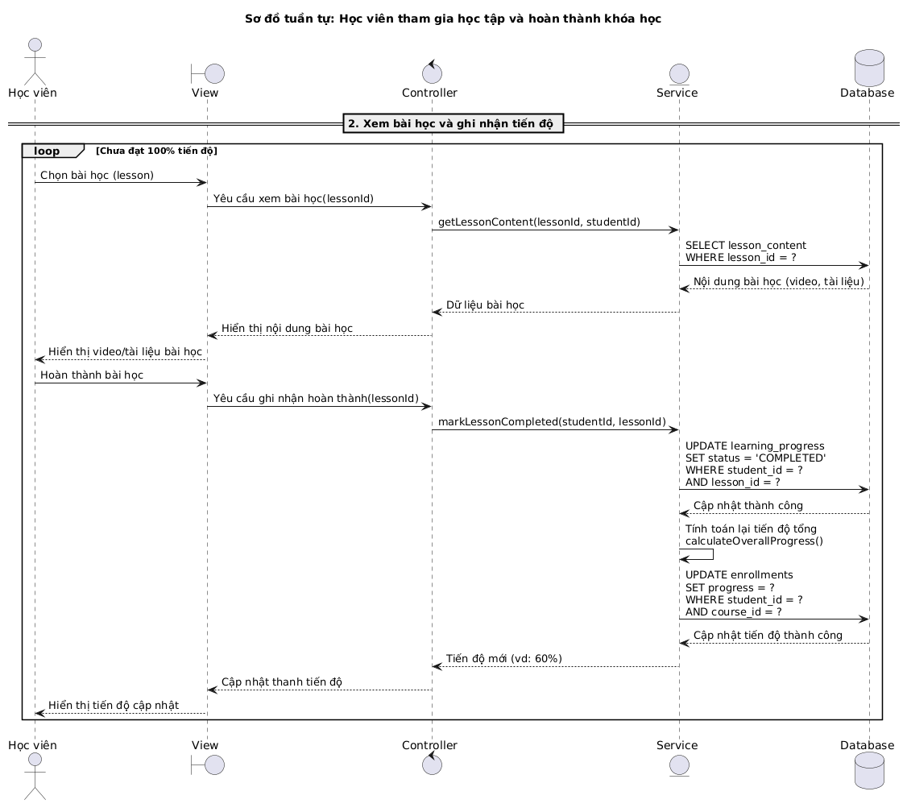

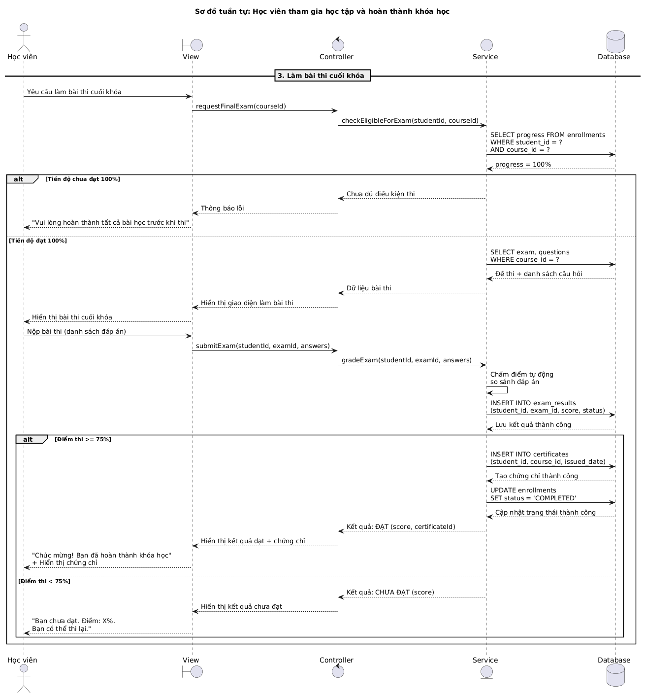

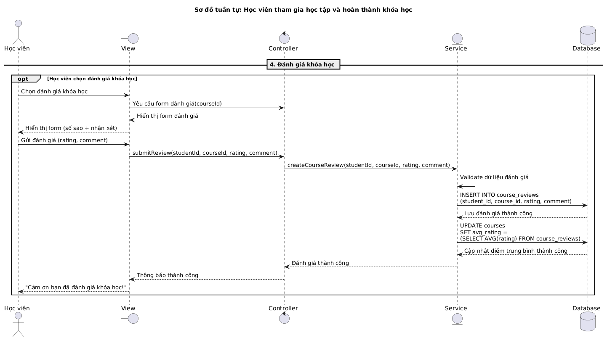

##### Hình 3.29. Sơ đồ tuần tự học viên học trực tuyến

#### 3.2.3.2. Sơ đồ tuần tự  học viên thanh toán khóa học

Quy trình bắt đầu khi học viên yêu cầu mua khóa học, hệ thống sẽ kiểm tra trạng thái đăng nhập và hiển thị trang xác nhận đơn hàng chứa thông tin chi tiết. Khi học viên chọn phương thức thanh toán và xác nhận, Service sẽ tạo đơn hàng mới trong DB với trạng thái "PENDING" và gọi API sang cổng thanh toán bên thứ ba để lấy URL giao dịch. Học viên thực hiện quét mã QR hoặc nhập thông tin thẻ và xác thực OTP trên ứng dụng ngân hàng. Sau khi nhận Callback thanh toán thành công, hệ thống cập nhật trạng thái đơn hàng thành "PAID", đồng thời tự động mở khóa quyền truy cập khóa học cho học viên (hết hạn sau 1 năm) và gửi email hóa đơn.

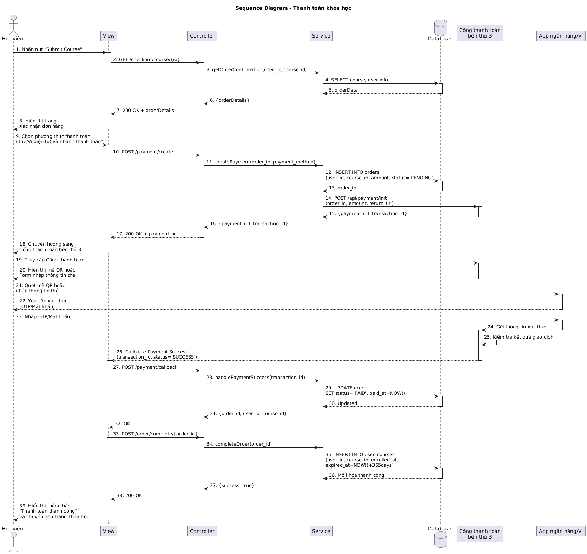

##### Hình 3.30. Sơ đồ tuần tự thanh toán khóa học

#### 3.2.3.1. Sơ đồ tuần tự QTV thêm mới khóa học

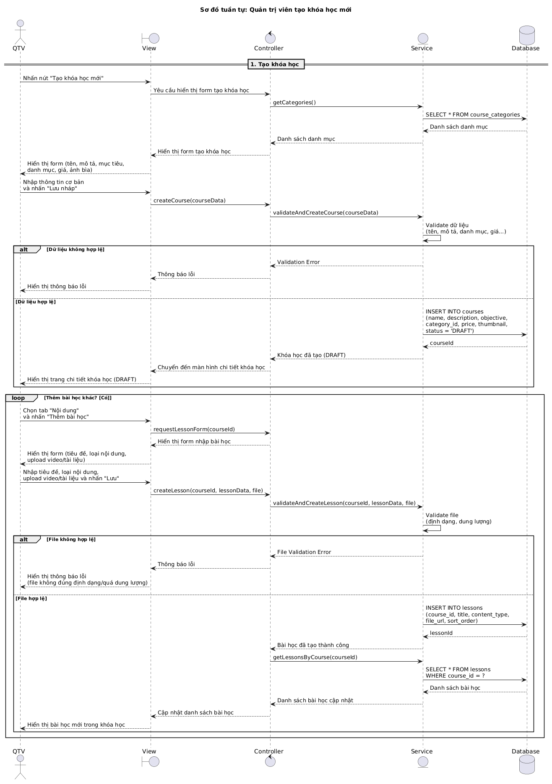

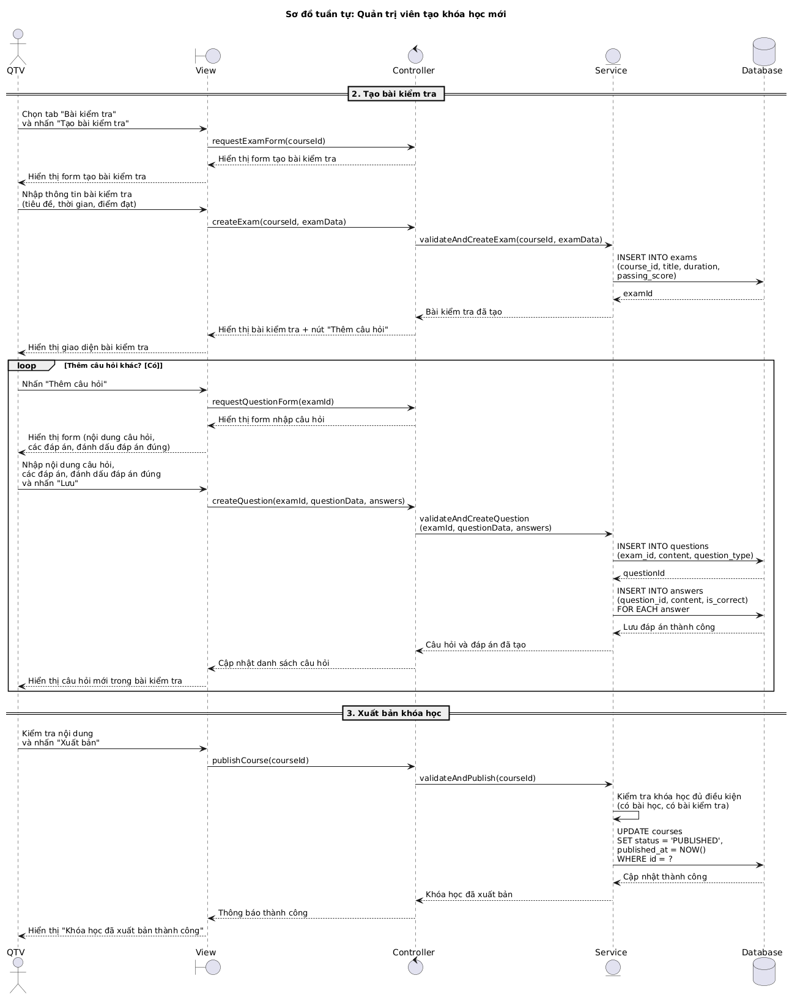

##### Hình 3.29. Sơ đồ tuần tự QTV thêm mới khóa học
