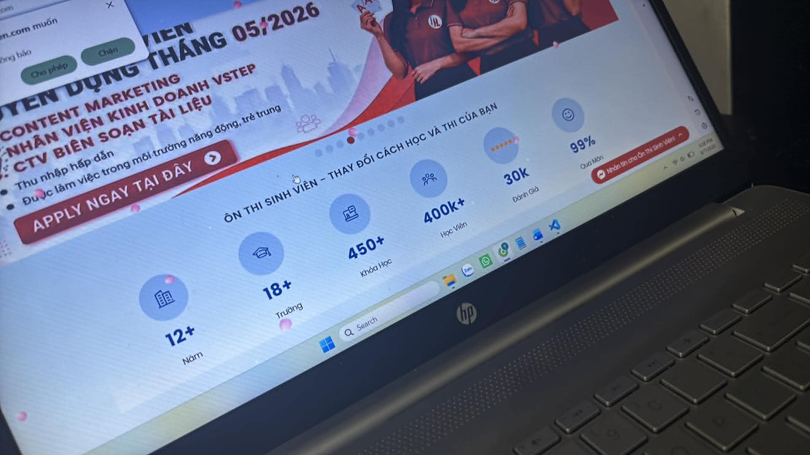
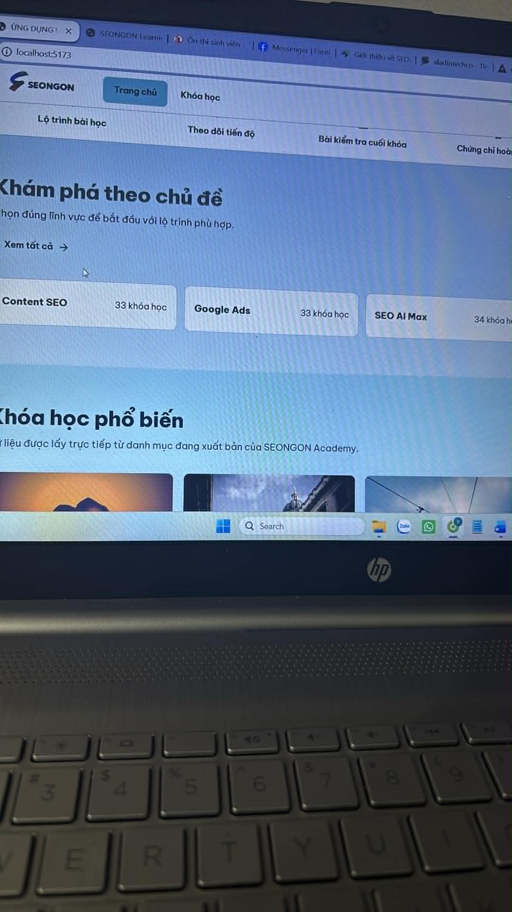
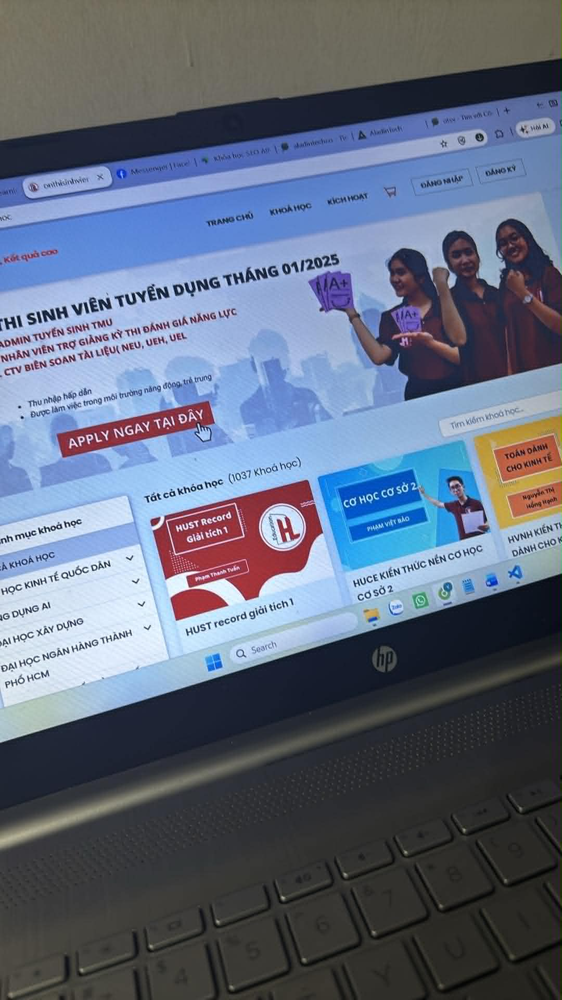

# Phản hồi khách hàng đã làm sạch

## 1. Phạm vi và nguyên tắc biên tập

- Nguồn chính: `raw_feedback.txt`, gồm `Part 1`, `Part 2` và `Part 3`.
- Nguồn hình ảnh đối chiếu: `anh_1.jpg`, `anh_2.jpg`, `anh_3.jpg`, `anh_4.jpg`.
- Đã loại bỏ từ đệm, câu lặp do nói ngập ngừng, tiếng click/ho/cười và từ ngữ khẩu ngữ không cần thiết; không loại bỏ bất kỳ yêu cầu, nhận xét, ví dụ hoặc ý định sản phẩm nào.
- Các tên bị nhận dạng sai như “Sale Ngon”/“Saigon” được chuẩn hóa thành **SEONGON**.
- Các cụm bị nhiễu được diễn giải theo ngữ cảnh và được ghi rõ tại mục 8; không coi phần diễn giải là câu nói nguyên văn.

## 2. Trang chủ và header công khai

### FB-01 — Tăng kích thước logo

Logo SEONGON trên header hiện quá nhỏ. Cần tăng kích thước để logo dễ nhận diện hơn.

### FB-02 — Thay cách thể hiện mục menu đang được chọn

Không muốn mục đang active bị bao phủ bởi một khối nền xanh nhạt như hiện tại. Cần dùng cách thể hiện active khác, gọn và tự nhiên hơn.

### FB-03 — Menu “Khóa học” có danh mục xổ xuống

Khi bấm hoặc mở mục **Khóa học**, nên hiển thị danh sách các category/danh mục khóa học thay vì chỉ dùng trạng thái active dạng khối nền.

### FB-04 — Căn lại bố cục header

Một phương án khách hàng đề xuất:

- Logo SEONGON căn hẳn về bên trái.
- Các mục điều hướng như **Trang chủ**, **Khóa học** và các mục liên quan căn về phía bên phải.

### FB-05 — Hiển thị giỏ hàng cả khi chưa đăng nhập

Header đang thiếu chức năng **Giỏ hàng**. Giỏ hàng và các control liên quan vẫn phải hiển thị với Guest, tương tự hành vi trên Shopee hoặc trang Ôn Thi Sinh Viên. Khi Guest bấm vào giỏ hàng, hệ thống cần đưa ra màn hình/thông báo yêu cầu đăng nhập, thay vì ẩn hoàn toàn chức năng.

### FB-06 — Thêm nút “Đăng ký” trực tiếp trên header

Header công khai cần có nút **Đăng ký** đặt cạnh **Đăng nhập**. Không nên bắt người dùng phải mở màn hình Đăng nhập rồi mới tìm thấy đường dẫn Đăng ký vì làm giảm khả năng chuyển đổi.

### FB-07 — Bổ sung mục “Tin tức” trên header

Website có phần blog/tin tức nhưng header công khai chưa có mục **Tin tức**. Cần bổ sung đường dẫn này.

## 3. Hero, hình ảnh và nội dung trang chủ

### FB-08 — Thay toàn bộ ảnh không liên quan đến nội dung khóa học

Các ảnh phong cảnh hoặc ảnh ngẫu nhiên hiện tại không liên quan đến khóa học/marketing cần được thay hết. Ảnh phải phản ánh đúng chủ đề của từng khóa học hoặc bối cảnh học tập, SEO, Ads, Content, Marketing.

### FB-09 — Viết lại thông điệp hero cho dễ hiểu

Thông điệp kiểu “SEO AI Max 01…” hoặc “nghiên cứu từ khóa AI” đang giống mã sản phẩm, khó hiểu với người dùng mới. Hero nên giới thiệu rõ giá trị của nền tảng, ví dụ:

> Nền tảng học tập Marketing thực chiến

Phần mô tả phụ có thể truyền đạt các ý:

- Học SEO, Content SEO và các năng lực Marketing từ đội ngũ SEONGON.
- SEONGON là đối tác của hơn 2.000 doanh nghiệp.
- Nội dung doanh nghiệp phải được kiểm tra và lấy từ website/kênh chính thức của SEONGON.

### FB-10 — Dùng nhiều hình ảnh thương hiệu hơn

Website cần có nhiều hình minh họa hơn, nhất là các ảnh lớn ở đầu trang. Có thể tham khảo tư liệu từ website chính thức của SEONGON; khi sử dụng thực tế cần dùng tài sản được phép sử dụng, đúng nhận diện và đúng ngữ cảnh.

### FB-11 — Bỏ hoặc thay dải 5 icon không tương tác

Dải gồm các mục **Lộ trình bài học**, **Theo dõi tiến độ**, **Bài kiểm tra cuối khóa**, **Chứng chỉ hoàn thành**, **Đánh giá khóa học** trông giống các nút nhưng không bấm được, gây hiểu nhầm và làm người xem bối rối.

Hai hướng được đề xuất:

1. Xóa dải này; hoặc
2. Thay bằng dải “những con số biết nói” như prototype/Ảnh 1.

### FB-12 — Làm CTA “Xem tất cả” nổi bật hơn

Nút/link **Xem tất cả** hiện chưa đủ đậm, bị chìm và chưa tạo cảm giác thôi thúc người dùng bấm. Cần tăng độ nổi bật về typography, màu sắc hoặc kiểu nút.

### FB-13 — Không dùng từ “lộ trình” cho danh sách khóa học rời rạc

Cụm “Chọn đúng lĩnh vực để bắt đầu với lộ trình phù hợp” gây hiểu nhầm vì các khóa học hiện là những khóa học độc lập, không phải một learning path có thứ tự. Cần đổi nội dung theo đúng bản chất danh mục khóa học.

### FB-14 — Hiển thị đầy đủ danh mục khóa học

“Khám phá theo chủ đề” được hiểu là danh mục khóa học. Cần liệt kê đầy đủ các danh mục hiện có, không chỉ hiển thị ba danh mục khiến bên phải bị trống và bố cục mất cân bằng.

### FB-15 — Giảm cảm giác giao diện do AI tạo ra

Giao diện hiện mang cảm giác “AI-generated” quá rõ, thiếu tự nhiên và khiến khách hàng không thoải mái. Cần tăng tính thương hiệu, tính người thật và bằng chứng xã hội thay vì dùng các khối nội dung chung chung.

### FB-16 — Bổ sung khu vực phản hồi học viên/social proof

Có thể tham khảo cách trình bày phản hồi học viên như Ảnh 3 để website bớt cảm giác nhân tạo. Nội dung phản hồi khi đưa vào sản phẩm phải là phản hồi có thật hoặc được phép sử dụng, không sao chép trái phép.

### FB-17 — Không để lưới “Khóa học phổ biến” bị khuyết

Nếu grid đang có 7 khóa học thì cần bổ sung thành 8 hoặc điều chỉnh quy tắc hiển thị để không còn một ô trống. Các cụm card/component trên trang không nên kết thúc bằng một khoảng khuyết gây mất cân bằng thị giác.

### FB-18 — Mở rộng footer

Footer hiện quá ngắn và nghèo nội dung. Cần làm footer đầy đủ hơn, gần với footer trong prototype về cấu trúc và lượng thông tin.

## 4. Trang danh sách khóa học

### FB-19 — Bổ sung lọc/sắp xếp theo giá

Bộ lọc cần có tiêu chí giá, trong đó khách hàng nêu cụ thể lựa chọn sắp xếp **giá cao nhất đến giá thấp nhất**.

### FB-20 — Không để chữ “Tìm kiếm” xuống dòng

Nút **Tìm kiếm** hiện bị tách thành “Tìm” và “kiếm” trên hai dòng. Toàn bộ nhãn phải nằm trên một hàng và có kích thước/padding phù hợp.

### FB-21 — Dùng hero/banner hình ảnh trên trang khóa học

Ở đầu trang khóa học, nên dùng một banner/ảnh lớn thay cho câu “Tìm đúng lộ trình cho mục tiêu bạn”. Câu hiện tại bị đánh giá là thô và kém thu hút hơn hình ảnh lớn. Ảnh 4 là tham chiếu về hướng bố cục có hero hình ảnh, tìm kiếm, danh mục và grid khóa học.

## 5. Trang đăng nhập

### FB-22 — Thay slogan bên cạnh form đăng nhập

Thông điệp kiểu “Quay lại lộ trình đang chờ bạn… trong một tài khoản duy nhất” bị đánh giá là gượng, chung chung và mang cảm giác do AI viết. Cần thay bằng slogan liên quan trực tiếp đến học tập, Marketing và kết quả/thành công mà người học có thể đạt được.

### FB-23 — Xóa nhãn “Tài khoản học tập”

Xóa dòng **Tài khoản học tập** đứng trước tiêu đề **Chào mừng bạn!**.

## 6. Khu vực quản trị

### 6.1. Kiến trúc điều hướng và header Admin

### FB-24 — Tách rõ Admin Portal và Public Site

Khi đăng nhập Admin, header không nên trộn các mục **Khóa học**, **Khóa học của tôi** và **Quản trị**. Cần có một khu vực quản trị riêng giống mô hình WordPress Admin. Admin Portal nên có nút để quay lại Public Site khi cần xem giao diện người dùng.

### FB-25 — Admin không đồng thời là học viên

Không hiển thị **Khóa học của tôi** cho tài khoản Admin. Nếu một nhân sự quản trị muốn học, họ cần đăng ký/dùng một tài khoản Student riêng như người học bình thường.

### FB-26 — Xóa các heading thừa và quá lớn

Các dòng như **Admin Console** và **Quản trị SEONGON LMS** đang quá lớn nhưng không cung cấp giá trị tương xứng. Vì đây là nội dung đập vào mắt đầu tiên, cần bỏ hoặc giảm mạnh mức độ nhấn để ưu tiên thông tin quản trị thực sự quan trọng.

### FB-27 — Xóa nội dung kỹ thuật hướng tới lập trình viên

Không hiển thị câu kiểu **Quản lý dữ liệu học tập bằng dữ liệu và quyền hạn từ Laravel API**. Người dùng quản trị không cần biết “Laravel API” là gì; nội dung UI phải dùng ngôn ngữ nghiệp vụ.

### 6.2. Dashboard Admin

### FB-28 — Dashboard cần biểu đồ/thông tin trực quan

Dashboard chỉ có bốn số lớn nên quá sơ sài và chưa hữu ích. Cần bổ sung biểu đồ, xu hướng hoặc các thành phần trực quan có giá trị quản trị thay vì chỉ trình bày số tổng.

### 6.3. Quản lý học viên

### FB-29 — Làm nổi bật các ô lọc

Ô **Tìm học viên** và **Trạng thái** cần có nền trắng hoặc độ tương phản rõ hơn; hiện chúng chìm vào background.

### FB-30 — Sửa padding nút “Áp dụng”

Padding trên/dưới và trái/phải của nút **Áp dụng** hiện không cân đối. Cần căn lại để nút có hình khối và alignment nhất quán.

### FB-31 — Mở rộng và căn chỉnh bảng học viên

Table, đặc biệt là phần header của bảng, đang quá hẹp và làm nội dung bị dồn. Cần tăng không gian hiển thị, căn cột rõ ràng và tránh cảm giác “bị ăn” nội dung.

### FB-32 — Làm rõ hành vi hover và control trạng thái

Khi rê chuột vào cột **Trạng thái** hoặc từng tài khoản, nền chuyển xám nhưng ý nghĩa tương tác không rõ; control chuyển trạng thái cũng chưa cho thấy nó dùng để làm gì. Cần làm rõ trạng thái có thể tương tác hay chỉ là nhãn, đồng thời dùng hover đúng với affordance.

### FB-33 — Bổ sung trường dữ liệu học viên

Bảng hiện chỉ có khoảng ba trường nên quá ít thông tin và chưa có giá trị quản trị. Cần có thêm các trường như:

- Email.
- Số điện thoại.
- Số/khóa học đã đăng ký.
- Ngày tạo tài khoản.
- Các trường trạng thái và thao tác cần thiết khác theo prototype.

### 6.4. Quản lý khóa học

### FB-34 — Áp dụng lại các sửa đổi của vùng lọc

Các vấn đề về nền ô search/filter và padding nút **Áp dụng** ở phần Học viên cũng tồn tại ở phần Khóa học; cần sửa nhất quán, không cần thiết kế hai kiểu khác nhau.

### FB-35 — Ưu tiên danh sách khóa học thay vì form tạo mới

Người quản trị vào mục **Khóa học** chủ yếu để xem/quản lý danh sách, trong khi việc tạo khóa học mới chỉ thỉnh thoảng diễn ra. UI cần theo hướng list-first; không để form tạo mới chiếm ưu tiên thị giác không đúng với tần suất sử dụng.

### FB-36 — Sửa table bị cắt và phải kéo ngang bất tiện

Bảng danh sách khóa học đang bị lẹm/cắt một số cột và phải kéo qua lại mới xem được. Cần bố trí lại chiều rộng, responsive behavior hoặc vùng scroll có chủ đích để bảng dễ đọc và thân thiện hơn.

### FB-37 — Sửa sai lệch số cột giữa header và body

Header bảng hiện chỉ thể hiện rõ các cột như **Trạng thái**, **Học phí**, **Thao tác**, trong khi một hàng dữ liệu bên dưới có khoảng sáu phần/cột. Header **Thao tác** cũng bị lệch sang một bên. Cần bảo đảm header và body có cùng cấu trúc, số cột và alignment.

### FB-38 — Bám sát prototype và mental model của người quản trị

Giao diện mục Khóa học cần gần prototype hơn để người dùng hiểu ngay luồng xem danh sách, lọc, tạo và thao tác khóa học. Cấu trúc hiện tại bị đánh giá là kém thân thiện và không đúng tư duy sử dụng mong đợi.

### 6.5. Quản lý Tin tức/Blog

### FB-39 — Bổ sung chức năng quản lý Tin tức/Blog

Admin hiện thiếu phần quản lý blog/tin tức dù website có nội dung Tin tức. Cần có chức năng quản trị tương ứng.

## 7. Khu vực học viên

### FB-40 — Không để “Khóa học của tôi” thành mục độc lập trên header

Không muốn có một nút **Khóa học của tôi** riêng trên thanh điều hướng chính. Khi bấm avatar của học viên, menu xổ xuống nên chứa ít nhất:

- Hồ sơ.
- Khóa học của tôi.

Ý này không thay thế FB-05: giỏ hàng vẫn phải tồn tại trên header theo đúng vai trò/trạng thái đăng nhập.

### FB-41 — Sửa thứ tự label và số trong các thẻ thống kê

Trong các thống kê **Tổng khóa học**, **Đang học**, **Đã hoàn thành**, label phải ở trên và con số ở dưới. Hiện thứ tự đang bị đảo, ví dụ số `3` xuất hiện trước label **Tổng khóa học**.

### FB-42 — Tách nền trắng của khu vực thống kê

Khu vực thống kê đang có background trắng bị lẹm hoặc không được tách khối rõ ràng. Cần sửa ranh giới section/container để nền không tràn sai.

### FB-43 — Sắp xếp lại thứ tự bộ lọc khóa học của tôi

Thứ tự đúng về logic phải là:

1. **Tất cả**.
2. **Đang học**.
3. **Đã hoàn thành**.

### FB-44 — Thêm khóa học demo đã hoàn thành

Cần có ít nhất một khóa học demo ở trạng thái **Đã hoàn thành** để trình diễn trọn luồng người học, đặc biệt là thao tác tải chứng chỉ.

### FB-45 — Làm nổi bật CTA “Khám phá thêm”

Nút **Khám phá thêm** đang chìm vào background. Cần dùng màu nền/kiểu hiển thị nổi bật và nhất quán với các CTA chính khác.

## 8. Đối chiếu bốn ảnh tham chiếu

### Ảnh 1 — Dải “những con số biết nói”

Ảnh thể hiện một dải social proof/statistics với các con số lớn như số năm, trường, khóa học, học viên, đánh giá và mức độ hài lòng. Ảnh này làm rõ phương án thay thế dải 5 icon không tương tác tại FB-11.

### Ảnh 2 — Giao diện hiện tại cần chỉnh

Ảnh cho thấy logo nhỏ, active menu dạng nền xanh nhạt, dải 5 mục giống nút nhưng không tương tác, chỉ ba category tạo khoảng trống, CTA **Xem tất cả** còn chìm và ảnh khóa học mang tính phong cảnh. Ảnh liên quan trực tiếp đến FB-01, FB-02, FB-11, FB-12, FB-13, FB-14 và FB-08.

### Ảnh 3 — Tham chiếu phản hồi học viên

Ảnh thể hiện một section phản hồi học viên bằng ảnh chụp hội thoại và phân trang. Đây là ngữ cảnh cho mong muốn thêm social proof để giao diện bớt cảm giác do AI tạo ra tại FB-15 và FB-16.

### Ảnh 4 — Tham chiếu trang danh sách khóa học

Ảnh thể hiện header có **Trang chủ**, **Khóa học**, **Kích hoạt**, giỏ hàng, **Đăng nhập**, **Đăng ký**; hero hình ảnh lớn; ô tìm kiếm; danh mục bên trái; và lưới card khóa học. Ảnh làm rõ FB-05, FB-06, FB-19, FB-20 và FB-21.

## 9. Các cụm bị nhiễu đã được chuẩn hóa

| Cụm trong transcript thô | Cách hiểu theo ngữ cảnh trong bản sạch |
|---|---|
| “Sale Ngon”, “Saigon” | SEONGON |
| “SEO AI Max không một” | SEO AI Max 01 hoặc tên/mã tương tự đang xuất hiện trên hero |
| “chương trình hoàn thành” | Chứng chỉ hoàn thành |
| “giáo học” | Đánh giá khóa học |
| “nghề tạo” | Ngày tạo |
| “tải chính trì” | Tải chứng chỉ |
| “header giống cái trong của em” khi đang nói footer | Footer cần giống/đầy đủ như prototype; người nói đã tự sửa từ “header” sang “footer” trong cùng đoạn |
| “nút salmon admin” | Mục/nút Admin hoặc Quản trị trên header; từ “salmon” là nhiễu nhận dạng |

## 10. Danh sách kiểm tra tính đầy đủ

- `Part 1`: FB-01 đến FB-21.
- `Part 2`: FB-22 đến FB-38.
- `Part 3`: FB-39 đến FB-45, đồng thời nhắc lại yêu cầu giỏ hàng ở FB-05 và tách vai trò Admin ở FB-24/FB-25.
- Bốn ảnh đã được đọc và gắn vào đúng nhóm ngữ cảnh; không ảnh nào chỉ được liệt kê mà không giải thích.
- Các ý lặp trong transcript không bị xóa khỏi ý nghĩa: chúng được liên kết lại bằng tham chiếu chéo để tránh tạo hai yêu cầu mâu thuẫn hoặc trùng ID.
