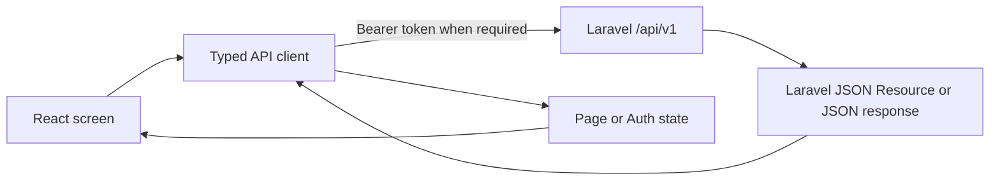

# SEONGON LMS Full UI Integration Design

**Date:** 2026-07-11  
**Status:** Approved design, ready for implementation planning

## Goal

Complete the existing React/MUI LMS interface so that the Guest, Student, and Admin experiences use the Laravel backend at `BE` as their single source of truth. The UI must preserve the existing teal visual identity, be responsive, and make backend failures understandable to the user.

## Design read

This is a trust-first learning product UI for employees and administrators. It is a product application, not a marketing landing page. The interface will use the existing MUI component system, a light theme, one teal accent (`#007E87`), and the existing 12px component-radius rule. Motion is limited to meaningful feedback; no decorative animation is required.

## System boundaries

- Frontend: `FE/DEMO`, React 18, React Router, MUI 7, Vite, Vitest, Testing Library.
- Backend: `BE`, Laravel 13, Sanctum bearer authentication, Pest/PHPUnit.
- API base URL: `VITE_API_BASE_URL`, defaulting to `http://localhost:8000/api/v1`.
- The frontend must not duplicate business rules already enforced by Laravel. It may disable unavailable actions for clarity, but the backend response remains authoritative.
- Admin-only contract extension: `GET /admin/courses/{course}` will return its existing course fields plus `data.quiz.questions.options`, including `is_correct`, through a dedicated admin resource. Public and student course resources remain unchanged and never expose answer correctness.

## API contract and response conventions

The API contract is the agreed request/response shape between the two applications. Public and protected data are supplied by Laravel resources; paginated Laravel resources expose `data` and `meta`. The frontend will keep the existing typed client in `src/app/lib/contracts.ts` and `src/app/lib/api.ts` aligned to those resource fields.

All fetch failures map to one `ApiError` shape with HTTP status, server message, and field errors. Forms display field-level validation when Laravel returns HTTP 422. Authentication failures clear the saved session and return users to login without pretending a protected action succeeded.

## User journeys

### Guest

1. Browse `/`, `/courses`, and `/courses/:slug`.
2. Filter published courses using the backend-supported `q`, `category`, `min_price`, `max_price`, and `sort` query parameters.
3. Register or log in through `/auth/register` and `/auth/login`.
4. From a course detail page, sign in before checkout.

### Student

1. Create an order with `POST /orders`, then pay it through `POST /orders/{order}/pay` using `card` or `qr`.
2. Read enrollments from `GET /my/courses`; an active enrollment contains a backend-computed progress summary.
3. Enter `/learn/:courseId`, load lessons and progress in parallel, then mark lessons complete using `POST /my/lessons/{lesson}/complete`.
4. Only open and submit the quiz after backend progress reports `can_take_exam: true`.
5. Display the returned score and completion result, allow a review, and download a certificate only through its authenticated endpoint.
6. Maintain profile and password through `/auth/profile` and `/auth/password`.

### Admin

1. Read dashboard statistics from `/admin/dashboard/stats`.
2. Search and update student status using `/admin/users` and `/admin/users/{user}/status`.
3. Create, edit, and delete categories.
4. Create, edit, publish/unpublish, and delete courses.
5. Add, edit, delete, and reorder lessons for a selected course.
6. Configure a quiz and maintain its questions/options.
7. Filter, show/hide, and delete reviews.

## Screen and component design

### Shared application shell

- `Layout` owns responsive navigation, account menu, role-aware links, and the global auth-ready state.
- `RequireAuth` has a dedicated loading state while session restoration calls `/auth/me`; protected content never flashes before authorization is known.
- Reusable `AsyncState` presentation patterns cover skeleton loading, empty data, recoverable error, and mutation feedback. The visual hierarchy is text-first with cards used only for actual grouping.

### Guest catalog and course detail

- Catalog filters are reflected in the request, reset predictably, and keep pagination metadata visible.
- Course detail uses Laravel `CourseResource` fields only. Missing thumbnail, instructor bio, lessons, rating, or quiz data have intentional fallbacks instead of mock content.
- CTAs distinguish unauthenticated, already-enrolled, and purchasable states based on available API data. Enrolled status is only inferred after authenticated data is loaded.

### Checkout

- Order creation happens once per user action. The payment choice is explicit, the button is disabled during mutation, and a failed mock-gateway payment stays recoverable without claiming enrollment.
- A successful response shows the new enrollment and offers navigation to My Courses.
- An existing active enrollment (422) is shown as a clear course-ownership message.

### Learning area

- The selected lesson is a local view state; lesson completion and exam permission always refresh from backend data.
- A video URL is embedded only when present. The lesson list presents completion state and preserves keyboard navigation.
- Quiz answers remain local until submit. The UI cannot expose answer correctness before the backend grades it.
- Certificate download uses authenticated `fetch`, creates a temporary object URL, clicks it, then revokes it.

### Admin workspace

- Admin functionality is arranged by data responsibility: Overview, Users, Categories, Courses, Content, and Reviews.
- Selected-course context drives lesson and quiz forms. Mutations refresh affected server data and retain a readable success/error notice.
- Existing endpoints that are not fully surfaced by the present demo (edit category/course/lesson, lesson reorder, edit/delete questions) are added without changing Laravel names, IDs, or validation. The approved admin-only course-detail resource extension supplies existing quiz/questions/options; it does not change public or student resource fields.
- Administrative tables/lists provide loading, empty, error, and confirmation handling for destructive actions.

## State and data flow

- `AuthProvider` persists only the bearer token in local storage, then validates it through `/auth/me` at startup.
- Public screen data stays local to each screen. No global cache is introduced because the current requirements do not need one.
- Mutations refresh the smallest affected query/page rather than manually constructing server-owned records.

## Error, empty, and accessibility requirements

- Every initial query has a MUI Skeleton layout matching the final content shape; mutations use disabled controls and an accessible progress label.
- Every collection explains its empty state and provides the next useful action.
- Laravel field errors are attached to their matching MUI inputs; generic errors appear in a dismissible `Alert`.
- Buttons have visible text, high-contrast primary/outlined states, a pressed-state transform, and no wrapping at desktop width.
- Responsive layouts collapse to one column below the relevant MUI breakpoint. Iframes keep a 16:9 ratio. No page uses `100vh`; use dynamic viewport-safe minimum heights where needed.

## Testing strategy

### Frontend unit/component tests

- API client: URL/query construction, bearer token, JSON response, 422 field errors, and authenticated certificate download failure.
- Authentication: restore session, clear invalid session, login/register persistence, and role-protected routing.
- Guest: catalog filtering and public course detail states.
- Student: checkout success/failure, lesson completion refresh, quiz gating/submission, review, and certificate-action error state.
- Admin: data loading, mutation payloads, and error/empty states for each management section.

### Backend contract tests

- Keep and extend Pest feature tests for public catalog, authentication, purchase, learning, quiz, and admin authorization.
- Add focused tests where an exposed UI endpoint lacks coverage, especially management update/reorder/delete paths and response fields consumed by the frontend.

### End-to-end local verification

1. Start Laravel with its local database and Vite frontend against `VITE_API_BASE_URL`.
2. Run a real browser flow: register/login, browse, order/pay success, complete lessons, submit a quiz, review, and download certificate.
3. Run an Admin flow with a seeded admin: create/update/publish a course, manage lessons/quiz/questions, update a user, and moderate a review.
4. Capture failures as test cases; no mocked frontend data is accepted as proof of backend integration.

## Out of scope

- Replacing Laravel business logic, Sanctum, payment gateway behavior, database schema, or API route names.
- Adding a new design system or third-party state-management/query library.
- Inventing payment processing, email, notifications, or analytics not exposed by this backend.

## Acceptance criteria

- All Guest, Student, and Admin routes use real Laravel API data, not `mockData.ts`.
- UI request/response types match Laravel resources and validation responses.
- Every API-driven screen has loading, empty, error, and responsive states.
- Frontend unit/component suite, Laravel test suite, frontend production build, and the two local end-to-end user flows pass with fresh evidence.
